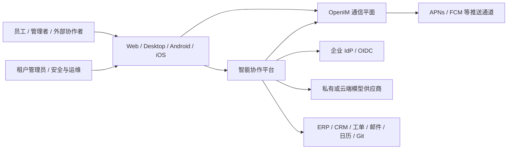
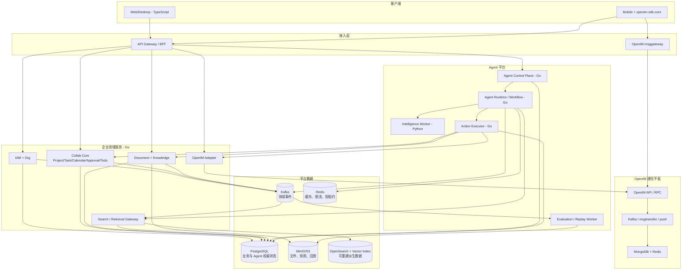
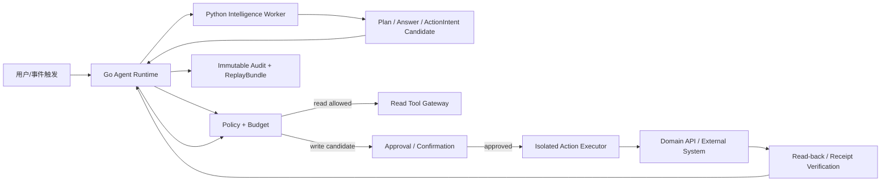
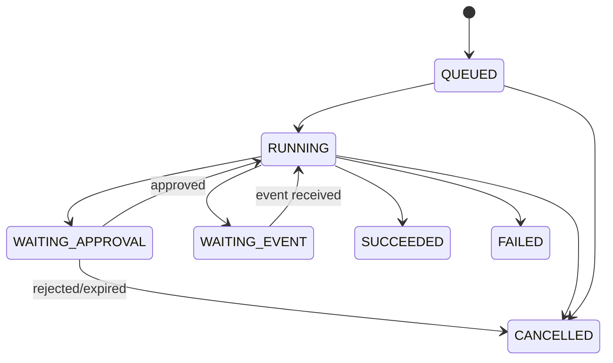
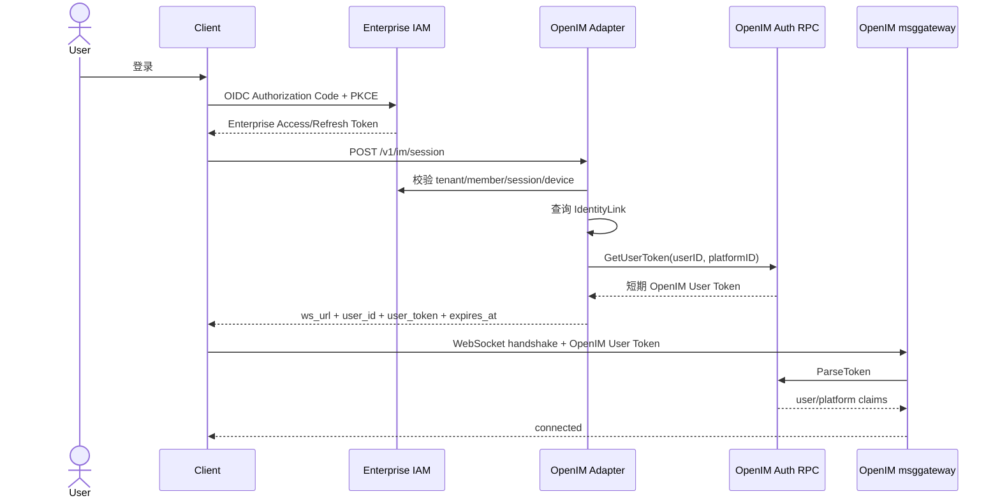
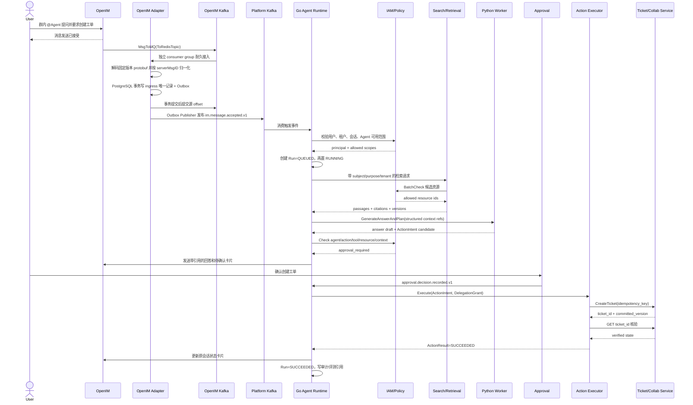
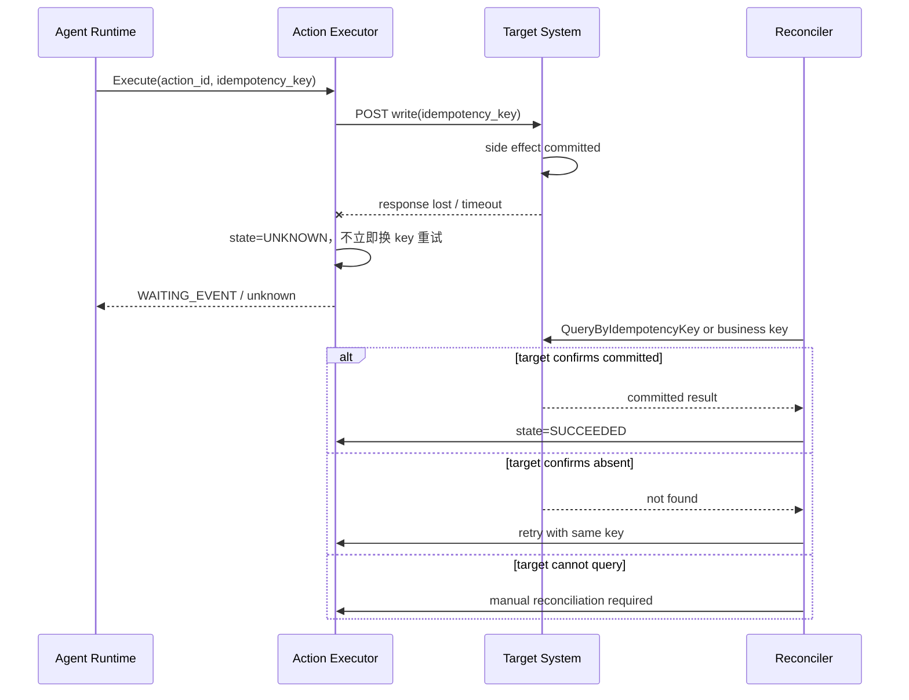
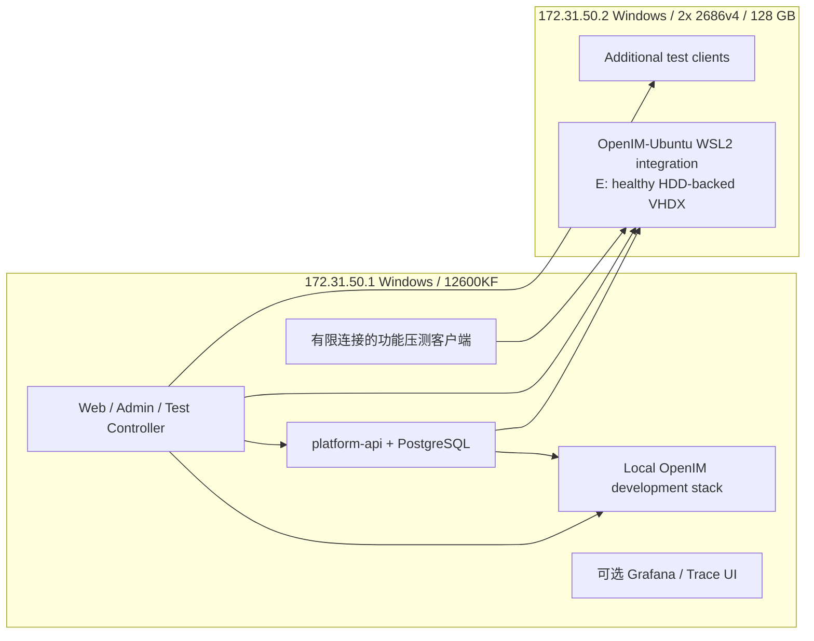
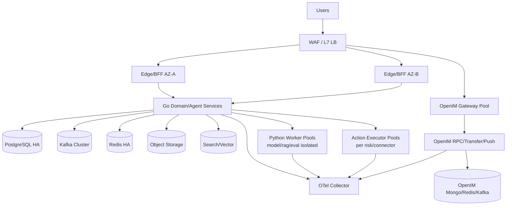

# OpenIM 智能协作平台总体架构设计

> 文档状态：Proposed
> 基线日期：2026-07-10
> 当前源码基线：`open-im-server@4f865f8`、`chat@0684daa`、`openim-sdk-core@8e55d32`、`openim-docker-v3.8@fb96638`
> 设计类型：在既有 OpenIM 上演进，不重写 OpenIM，不把项目描述为“从零自研 IM”

## 0. 结论标签

本文使用以下标签，避免把源码事实、论文结论和未来方案混在一起：

- **FACT**：已由当前本地源码、配置或已有压测记录验证。
- **EXTERNAL EVIDENCE**：来自论文、标准或一手工程报告，只证明其原始场景。
- **INFERENCE**：由多项事实推导出的设计判断，尚未由本项目实测完全证明。
- **PROPOSAL**：建议实施的目标方案或指标。
- **ASSUMPTION**：尚需产品、容量、安全或组织决策确认的前提。

---

## 1. 执行决策

### 1.1 一句话方案

**PROPOSAL**：保留 OpenIM 作为可靠、可独立扩缩容的实时通信平面，在其上新增企业业务事实平面、协同内容平面、统一搜索知识平面和受控 Agent 平面，形成“沟通、协作、知识、执行、审计”闭环。

目标产品不是简单的“QQ 加机器人”，也不是一开始复制飞书的全部功能，而是分阶段形成：

1. **沟通层**：单聊、群聊、关系链、会话、已读回执、离线推送、多端同步。
2. **协作层**：组织、项目、任务、日历、会议、审批、统一待办、文档、文件、知识库、搜索。
3. **智能层**：企业问答、会议纪要、任务抽取、知识整理、流程辅助、跨系统操作、团队 Agent。
4. **治理层**：租户隔离、资源授权、委托凭证、审批、幂等执行、审计、回放、评测、成本控制。

### 1.2 八项核心决策

| 编号 | 决策 | 直接原因 |
| --- | --- | --- |
| D1 | OpenIM 保持为通信平面，不在消息热路径同步调用模型 | 推理延迟、失败率和成本不能影响 IM 可用性 |
| D2 | 企业业务事实由 PostgreSQL 领域服务拥有 | 任务、审批、组织等需要事务、唯一约束和明确所有权 |
| D3 | 初期按领域组织成少量可部署单元，不拆成几十个微服务 | 当前团队和三机环境无法承担过早微服务化的运维成本 |
| D4 | 采用 `Go Agent Runtime + Python Intelligence Plane` | Go 持有可信状态和策略；Python 承载模型、RAG、重排和评测生态 |
| D5 | 模型输出永远是候选结果，写操作必须经过 Action Executor | 防止提示注入、越权、重复写和不确定结果造成真实副作用 |
| D6 | 跨领域事件采用 PostgreSQL Transactional Outbox + Kafka + Inbox | 避免“业务表成功、发事件失败”的双写不一致 |
| D7 | 协同编辑复用成熟 CRDT/OT 引擎，不自行实现算法 | 富文本并发编辑、离线合并、撤销和 schema 演进复杂度高 |
| D8 | MCP 只作为外部工具/资源协议，Memory、Session、Policy、Runtime 属于核心平台 | 协议互操作不等于运行时治理和业务状态所有权 |

### 1.3 最大未决风险

**ASSUMPTION**：目标租户数、在线人数、文档并发、知识体量、模型供应商、数据合规级别尚未冻结。本文给出的是可演进基线，所有容量数字都标注为“已测”“建议”或“待测”，不把三机 Compose 结果外推为生产集群容量。

---

## 2. 范围与非目标

### 2.1 本期架构范围

- 统一租户、组织、成员、角色和资源授权。
- OpenIM 与企业身份的账号映射、Token 兑换和消息事件适配。
- 项目、任务、日历、会议、审批、待办的业务骨架。
- 文档、文件、知识库、检索和 ACL 过滤。
- Agent 定义、版本、会话、运行、步骤、工具、动作、审批、记忆、评测和回放。
- API、gRPC、事件、存储、部署、安全、可观测性和迁移方案。
- `.1` Windows 开发机与 `.2` Windows/WSL2 集成机的双机实验部署方案，以及未来生产拓扑。

### 2.2 明确非目标

- 不修改 OpenIM 的 seq、推送、消息存储和 SDK 同步算法来承载业务事实。
- 不把聊天消息本身当作任务、审批、文档或 Agent 运行的权威数据。
- 不承诺第一阶段具备飞书完整产品矩阵、超大规模多地域容灾或全自治 Agent。
- 不自行训练基础大模型，不把向量数据库当作权威知识库。
- 不在第一阶段建设 20 个以上独立微服务、Service Mesh 或跨地域 Cell。
- 不使用“exactly once”描述整条业务链；目标是通过幂等、状态机和对账实现业务级 effectively-once。

---

## 3. 当前系统事实

### 3.1 仓库与部署基线

**FACT**：当前工作区是多个独立 Git 仓库的集合，不是一个统一 Git 根。主要基线如下：

| 仓库 | 当前提交 | 当前职责 |
| --- | --- | --- |
| `open-im-server` | `4f865f8` | IM API、WebSocket 网关、RPC、消息转存、在线/离线推送 |
| `chat` | `0684daa` | 产品层注册登录、账号凭据、Chat Token、调用 OpenIM 管理接口 |
| `openim-sdk-core` | `8e55d32` | 长连接、本地数据库、消息同步、seq 补拉、多端状态 |
| `openim-docker-v3.8` | `fb96638` | MongoDB、Redis、etcd、Kafka、MinIO、监控与服务编排 |

**FACT**：Compose 中可直接确认 MongoDB、Redis、etcd、Kafka、MinIO、Prometheus、Grafana、OpenIM Server 和 Chat，入口分别见：

- `openim-docker-v3.8/docker-compose.yaml:6`
- `openim-docker-v3.8/docker-compose.yaml:50`
- `openim-docker-v3.8/docker-compose.yaml:73`
- `openim-docker-v3.8/docker-compose.yaml:170`
- `openim-docker-v3.8/docker-compose.yaml:238`
- `openim-docker-v3.8/docker-compose.yaml:274`
- `openim-docker-v3.8/docker-compose.yaml:305`
- `openim-docker-v3.8/docker-compose.yaml:340`
- `openim-docker-v3.8/docker-compose.yaml:382`

### 3.2 当前消息运行链路

**FACT**：当前单聊/群聊发送主链路为：

```text
设备端 App
  -> openim-sdk-core
  -> WebSocket msggateway
  -> Msg RPC
  -> Kafka toRedis
  -> msgtransfer
  -> 分配 seq / 写 Redis 消息缓存
  -> Kafka toMongo -> MongoDB
  -> Kafka toPush -> push
  -> msggateway
  -> 接收端 SDK
  -> seq 连续性检查 / 缺口补拉 / 本地库 / UI 回调
```

源码依据：

- 消息 RPC 入口：`open-im-server/internal/rpc/msg/send.go:34`。
- 单聊和群聊写入 Kafka：`open-im-server/internal/rpc/msg/send.go:63`、`:180`。
- `ToRedisTopic` producer：`open-im-server/pkg/common/storage/controller/msg.go:105`、`:110`、`:132`。
- msgtransfer 消费 `ToRedisTopic`：`open-im-server/internal/msgtransfer/online_history_msg_handler.go:82`、`:84`。
- 分配 seq 并写缓存：`open-im-server/internal/msgtransfer/online_history_msg_handler.go:272`。
- 转入 Mongo 和 Push topic：同文件 `:325`、`:332`、`:382`。
- Push 消费和在线推送：`open-im-server/internal/push/push_handler.go:52`、`:221`。
- 群成员展开：`open-im-server/internal/push/push_handler.go:247`。
- SDK 同步器和缺口补拉：`openim-sdk-core/internal/interaction/msg_sync.go:48`、`:220`、`:318`、`:346`。
- 长连接重连：`openim-sdk-core/internal/interaction/long_conn_mgr.go:378`、`:697`。

**FACT**：`SendMsgResp` 的成功语义主要是 Msg RPC 已完成校验并成功将消息交给 Kafka producer；它不等于 MongoDB 已持久化、接收端已收到或用户已阅读。证据是 `MsgToMQ` 之后立即构造响应，而 Redis/Mongo/Push 在后续消费者中完成。

### 3.3 当前身份与接入边界

**FACT**：Chat 与 OpenIM Token 是两套不同信任域：

- Chat 注册：`chat/internal/rpc/chat/login.go:216`。
- Chat 登录：`chat/internal/rpc/chat/login.go:372`。
- Chat Token 创建：`chat/internal/rpc/chat/login.go:361`、`:436`，具体实现位于 `chat/internal/rpc/admin/token.go:27`。
- Chat 服务端换取 OpenIM User Token：`chat/pkg/common/imapi/caller.go:106`。
- OpenIM User Token 签发：`open-im-server/internal/rpc/auth/auth.go:108`、`:129`。
- WebSocket 建连鉴权：`open-im-server/internal/msggateway/ws_server.go:473` 调用 `ParseToken`。
- Token 解析：`open-im-server/internal/rpc/auth/auth.go:138`、`:167`。

**INFERENCE**：升级后应新增统一企业 Access Token，但不能删除 OpenIM User Token。正确做法是由 OpenIM Adapter 在服务端完成身份映射和 Token 兑换；OpenIM Admin Token 永远不下发到设备端。

### 3.4 可利用的低侵入集成点

**FACT**：OpenIM 已提供发送前后 Webhook：

- 单聊发送后：`open-im-server/internal/rpc/msg/callback.go:86`。
- 群聊发送后：`open-im-server/internal/rpc/msg/callback.go:120`。
- 调用点：`open-im-server/internal/rpc/msg/send.go:71`、`:184`。

**FACT**：after-send 的 `AsyncPost` 使用进程内 `MemoryQueue`，默认只有 2 个 worker 和 100 个 buffer；当前实现把 HTTP 调用推入内存队列，没有可见的持久化 spool 或失败重放，见 `open-im-server/pkg/common/webhook/http_client.go:34`、`:38`、`:39`、`:63`、`:65`。因此它适合低延迟通知，但不能单独作为生产级必达事件源。

**DECISION**：生产只采用一条耐久入口。OpenIM Adapter 使用独立 consumer group 消费 OpenIM `ToRedisTopic`，不影响 msgtransfer 原 consumer group；解码固定版本的 `sdkws.MsgData`，在同一 PostgreSQL 事务写 ingress 唯一记录和 Outbox，提交成功后才提交源 Kafka offset。`serverMsgID` 是必需的 source key，缺失或无法映射租户的记录先写 durable rejection，再提交 offset。

after-send Webhook 不进入 Agent 触发链。保留其上游能力用于非关键通知，但不实现 Webhook 快路径、双入口去重或“Kafka 兜底”，从而避免两套生产语义和无法证明的回调必达假设。

该事件准确命名为 `im.message.accepted.v1`：它与 OpenIM 写入 `ToRedisTopic` 的接受语义对齐，不冒充 MongoDB 已持久化。若未来业务必须在最终消息存储后才触发，应在 msgtransfer/Mongo 完成点增加明确的 `im.message.persisted.v1`，而不是改变 Msg RPC 热路径。

### 3.5 已有性能证据及边界

**FACT**：`openim-bench/message-bench-summary-20260704.md` 记录了官方 `openim-sdk-core/msgtest` SDK/WebSocket 单聊发送路径：

- `.2` 和 `.5` 的单节点 Compose 在已完成测试中约达到 `8k-9k msg/s` 后延迟明显上升。
- 已完成批次客户端观察到的发送失败数为 0。
- 该结果只证明测试路径下的“客户端收到发送响应”，不证明每条消息已最终写 MongoDB、群 fanout、生产高可用或多节点聚合容量。
- 5 万连接保持实验证明连接维持能力的一部分，不等价于 5 万人群聊的消息吞吐能力。

**PROPOSAL**：新增平台后必须分别测四类容量，不能用一个数字替代：

1. IM 连接容量。
2. IM 单聊/群聊消息入口与 fanout。
3. 协作 API 和事件积压能力。
4. Agent 接受、首 token、工具执行、模型并发与单位任务成本。

---

## 4. 外部研究证据与迁移判断

### 4.1 研究覆盖

本设计广度扫描了消息系统、社交图、领域拆分、授权、协同编辑、工作流、可观测性、RAG、Agent、工具协议和 AI 安全等 28 项一手资料；下表列出对决策有直接影响的 26 项。论文或大厂规模只证明其原始场景，不能直接证明本项目具备同样性能。

| 来源 | 年份/类型 | 原始问题与证据 | 本项目迁移判断 | 决策影响 |
| --- | --- | --- | --- | --- |
| [Kafka: a Distributed Messaging System for Log Processing](https://cwiki.apache.org/confluence/download/attachments/27822226/Kafka-netdb-06-2011.pdf?api=v2&modificationDate=1311164782000&version=1) | 2011，NetDB | 分区日志、顺序访问、批量传输、可回放消费 | **Adopt**：沿用 Kafka 做异步解耦；顺序只在分区键范围内 | D1、D6 |
| [How Discord Stores Trillions of Messages](https://discord.com/blog/how-discord-stores-trillions-of-messages) | 2023，一手工程报告 | channel+时间桶分区；热点造成尾延迟；迁移用 checkpoint、shadow read | **Adapt**：监控热点、迁移可续跑并影子比对；当前不引入 ScyllaDB | 消息/事件分区、迁移 |
| [TAO: Facebook's Distributed Data Store for the Social Graph](https://www.usenix.org/conference/atc13/technical-sessions/presentation/bronson) | 2013，USENIX ATC | 对对象/关联提供受限 API，缓存与持久层分离 | **Adapt**：组织、群、好友关系通过领域 API，缓存可重建 | Org/IAM 边界 |
| [Dynamo](https://web.stanford.edu/class/cs244/papers/amazon-dynamo-sosp2007.pdf) | 2007，SOSP | 面向高可用键值场景的最终一致和冲突处理 | **Reject as default**：审批和任务需要事务；仅借鉴故障权衡 | PostgreSQL 作为业务事实 |
| [Domain-Oriented Microservice Architecture](https://www.uber.com/bg/en/blog/microservice-architecture/) | 2020，Uber | 约 2,200 个关键微服务后的复杂度；领域、分层、网关和扩展点 | **Adopt**：先领域化、少量部署单元，经指标证明后再拆 | D3 |
| [Cell-Based Architecture](https://docs.aws.amazon.com/wellarchitected/latest/reducing-scope-of-impact-with-cell-based-architecture/reducing-scope-of-impact-with-cell-based-architecture.html) | 2023，AWS 指南 | Cell 路由、容量维度和故障爆炸半径 | **Defer**：生产规模和合规出现后采用；三机实验不伪装成 Cell | 未来生产拓扑 |
| [Making retries safe with idempotent APIs](https://aws.amazon.com/builders-library/making-retries-safe-with-idempotent-APIs/) | AWS Builders' Library | 客户端请求 ID、语义等价和迟到请求 | **Adopt**：每个 ActionIntent 和写工具必须有幂等键与结果记录 | D5 |
| [Zanzibar](https://www.usenix.org/conference/atc19/presentation/pang) | 2019，USENIX ATC | 统一关系授权，强调 ACL 变更与内容访问的因果一致 | **Adapt**：统一资源关系模型和批量 Check API；不复制 Google 全球系统 | IAM/ACL |
| [NIST SP 800-207 Zero Trust](https://csrc.nist.gov/pubs/sp/800/207/final) | 2020，标准 | 不因网络位置隐式信任，按主体、设备、资源逐次判定 | **Adopt**：人、服务、Agent、工具均有独立身份和最小权限 | 安全模型 |
| [Cedar](https://aws.amazon.com/about-aws/whats-new/2023/05/cedar-open-source-language-access-control/) | 2023，官方技术说明 | 可分析的 RBAC/ABAC policy-as-code | **Experiment**：第一阶段先定义授权接口；Cedar 与 OPA 做原型对比 | Policy Engine |
| [OpenID Connect Core](https://openid.net/specs/openid-connect-core-1_0.html) | 2023 errata，标准 | OAuth 2.0 上的身份层、ID Token 和 Claims | **Adopt**：企业 SSO 和设备登录标准入口 | 统一身份 |
| [OAuth 2.0 Token Exchange RFC 8693](https://www.rfc-editor.org/rfc/rfc8693.html) | 2020，IETF | 主体 token 与 actor token 的委托/交换模型 | **Adapt**：短期 DelegationGrant 表达用户委托 Agent 的权限 | Agent 委托 |
| [Figma Multiplayer](https://www.figma.com/blog/how-figmas-multiplayer-technology-works/) | 2019，一手工程报告 | WebSocket、客户端乐观更新、服务端排序、按数据模型选择合并策略 | **Adapt**：协同内容与普通业务数据走不同同步机制 | D7 |
| [Making multiplayer more reliable](https://www.figma.com/blog/making-multiplayer-more-reliable/) | 2022，一手工程报告 | 内存权威协同服务增加 WAL；报告 95% 编辑在 600ms 内保存 | **Adapt/Experiment**：操作日志+快照；本地压测后确定实现 | 文档可靠性 |
| [Fluid Framework Architecture](https://fluidframework.com/docs/concepts/architecture) | 当前官方文档 | 服务端总序广播，客户端合并，操作历史和 summary | **Experiment**：与 Yjs/Automerge/现成编辑服务做 PoC，不自研 CRDT | D7 |
| [Peritext](https://www.inkandswitch.com/peritext/) | 2022，CSCW | 富文本格式并发比纯文本 CRDT 更复杂 | **Adopt as constraint**：禁止用简单字符串 LWW 冒充富文本协作 | D7 |
| [Debezium Outbox Event Router](https://debezium.io/documentation/reference/stable/transformations/outbox-event-router.html) | 当前官方文档 | 业务状态与事件同事务写入；event id 去重；aggregate id 保序 | **Adopt**：PostgreSQL Outbox，首期可轮询发布，后续 CDC | D6 |
| [Cadence 1.0](https://www.uber.com/in/en/blog/announcing-cadence/) | 2023，Uber | 长流程持久状态、重放、可观测和故障恢复；同时揭示多租户隔离成本 | **Adapt**：优先复用 Temporal/Cadence 类引擎；Agent Runtime 不重造通用调度器 | Agent/审批流程 |
| [Dapper](https://research.google/pubs/dapper-a-large-scale-distributed-systems-tracing-infrastructure/) | 2010，Google 论文 | 低开销、公共库插桩、采样的分布式追踪 | **Adopt**：统一 trace context，关键 Agent/Action 全采样 | 可观测性 |
| [Retrieval-Augmented Generation](https://proceedings.neurips.cc/paper/2020/hash/6b493230-Abstract.html) | 2020，NeurIPS | 参数记忆结合可更新的非参数检索，并可提供来源 | **Adopt with controls**：检索结果必须 ACL 过滤、保留版本和引用 | RAG |
| [AgentBench](https://openreview.net/pdf/6eee0bd1fd98c135372baedb2a5644233a013bb2.pdf) | 2024，ICLR | 29 个模型在 8 类交互环境中表现差异显著 | **Adopt as warning**：模型可用性必须按业务任务评测，不能凭聊天体验上线 | Eval |
| [AgentDojo](https://proceedings.neurips.cc/paper_files/paper/2024/hash/97091a5177d8dc64b1da8bf3e1f6fb54-Abstract-Datasets_and_Benchmarks_Track.html) | 2024，NeurIPS | 97 个任务、629 个安全用例显示工具返回数据可注入并劫持 Agent | **Adopt as threat model**：外部内容不可信；模型不能直接持有写权限 | D5 |
| [Lost in the Middle](https://aclanthology.org/2024.tacl-1.9/) | 2024，TACL | 长上下文中相关信息位置会显著影响表现 | **Adopt as constraint**：必须检索、重排和压缩，不能“把全部企业数据塞进上下文” | RAG/Memory |
| [Building Effective Agents](https://www.anthropic.com/engineering/building-effective-agents) | 2024，一手工程报告 | 简单可组合工作流优先；自治提高成本并累积错误 | **Adopt**：固定流程优先，只有开放任务才进入 Agent loop | Agent 模式 |
| [MCP Architecture](https://modelcontextprotocol.io/specification/2025-11-25/architecture) | 2025，协议规范 | Host 管理权限、上下文和多 Server 隔离；MCP 是上下文/工具协议 | **Adopt at edge**：用于外部工具互操作，不替代平台 Runtime | D8 |
| [NIST AI RMF GenAI Profile](https://www.nist.gov/publications/artificial-intelligence-risk-management-framework-generative-artificial-intelligence) | 2024，标准 | 生成式 AI 风险识别、治理、测量与管理 | **Adopt**：模型/提示/数据/工具版本化，持续评测和事故流程 | AI 治理 |

### 4.2 研究真正改变了什么

1. **没有采用“每个功能一个微服务”**：Uber 的生产经验说明微服务会形成网络化单体，因此本设计先按领域聚合部署。
2. **没有让 Agent 直接写业务库**：AgentDojo、NIST 和零信任原则共同要求把模型输出限制为候选动作。
3. **没有自研协同编辑算法**：Figma、Fluid、Peritext 证明不同数据模型需要不同冲突语义。
4. **没有把大上下文当作知识系统**：RAG 与 Lost in the Middle 要求检索、来源、重排和评测。
5. **没有承诺全链 exactly-once**：Kafka、Outbox 和幂等 API 共同指向“至少一次传输 + 业务效果一次 + 对账”。

---

## 5. 架构驱动与不变量

### 5.1 核心参与者

| 参与者 | 主要目标 |
| --- | --- |
| 企业员工 | 沟通、查知识、创建和推进协作事项 |
| 管理者 | 组织管理、审批、项目视图、Agent 成本和风险控制 |
| 外部协作者 | 在受限空间中沟通和编辑，不获得租户内隐式权限 |
| 业务管理员 | 配置工作流、Agent、工具、知识源、权限和保留策略 |
| Agent | 在明确委托范围内读取、推理、生成候选动作并等待/执行审批 |
| 平台运维/安全 | 发布、容量、告警、审计、恢复、事件响应和合规导出 |

### 5.2 必须保持的业务不变量

1. 每个持久实体只有一个权威服务和一个权威存储。
2. 消息发送成功、业务提交成功、Agent 动作执行成功是三个不同状态。
3. 聊天消息和通知只携带业务对象引用，不承载业务对象全部真相。
4. 资源删除、成员离职或 ACL 收紧后，搜索、向量索引和 Agent 记忆最终都必须撤销可见性。
5. Agent 权限不得超过“发起人权限 ∩ Agent 配置权限 ∩ 工具策略 ∩ 当前资源 ACL”。
6. 所有写工具都必须授权、幂等、可审计、可核验，并处理“对方已执行但本方超时”的未知结果。
7. IM 热路径在 Agent、RAG、协作域故障时仍能独立提供核心消息能力。
8. 模型、提示、工具、知识快照和策略版本必须能组成可回放证据。

### 5.3 容量和 SLO 假设

以下是 **PROPOSAL**，不是当前已测能力：

| 维度 | 第一阶段设计包络 | 说明 |
| --- | --- | --- |
| 租户 | 100 个活跃租户 | 数据库行级租户隔离，支持后续分片 |
| 注册成员 | 100 万 | 不代表同时在线 |
| 峰值在线 | 10 万 | 需独立生产级 OpenIM 集群验证 |
| 协作 API 峰值 | 5,000 RPS | 按租户/资源限流 |
| Agent Run 接受 | 500 RPS | 接受即持久化，不等于完成 |
| 同时活跃 Agent Run | 5,000 | 按租户、模型、工具池隔离 |
| 单文档并发编辑 | 200 | 需要选型 PoC 和专项压测 |
| 知识文档 | 1,000 万份 | 原文在对象存储，元数据/ACL 在 PostgreSQL |

| 用户旅程 | SLI | 建议 SLO | 成功语义 |
| --- | --- | --- | --- |
| IM 发消息 | 客户端发送响应 | 延续 OpenIM 独立 SLO | 已被消息入口接受，不代表最终阅读 |
| 协作写入 | API p95 / 成功率 | p95 < 300ms，月可用性 99.9% | PostgreSQL 事务和 Outbox 同时提交 |
| Agent 接受 | `Run` 持久化延迟 | p95 < 500ms，99.9% | `Run=QUEUED` 已持久化 |
| Agent 首次可见输出 | 首 token/首进度 | p95 < 5s | 用户看到可取消的运行进度 |
| 写工具 | 已验证动作成功率 | >= 99.9%，重复副作用 0 | 执行结果经目标系统查询或回执核验 |
| 企业知识问答 | ACL 泄漏 | 0 | 未授权文档不得进入检索上下文或引用 |

---

## 6. 目标总体架构

### 6.1 五个平面

**PROPOSAL**：平台逻辑上划分为五个平面，但第一阶段不要求每个平面都拆成独立服务：

| 平面 | 权威职责 | 明确不负责 |
| --- | --- | --- |
| 实时通信平面 | OpenIM 消息、会话、群组、关系链、在线状态、推送、SDK 同步 | 任务、审批、文档和 Agent 最终状态 |
| 企业业务事实平面 | 租户、组织、项目、任务、日历、会议、审批、待办 | 消息可靠性、模型推理 |
| 内容与知识平面 | 文档元数据、文件、版本、知识源、ACL 检索、引用 | 身份签发、业务副作用 |
| Agent 控制与智能平面 | Run 状态、预算、策略、规划、检索、模型调用、评测 | 绕过审批直接改变业务事实 |
| 执行与治理平面 | 写工具执行、幂等、核验、审计、合规、可观测性 | 自主扩张 Agent 权限 |

### 6.2 系统上下文



信任边界：

- 客户端、外部网页、知识文档、邮件和工具返回内容均视为不可信输入。
- 模型供应商只接收最小化、脱敏且经策略允许的上下文。
- Agent 规划和 Python Worker 均不能直接持有生产数据库写权限或租户管理员凭据。
- Action Executor 是唯一允许代表 Agent 调用写工具的边界。

### 6.3 容器与权威存储



### 6.4 第一阶段部署单元

**PROPOSAL**：第一阶段采用模块化单体优先，只保留少量有真实运行时隔离理由的部署单元。进程内仍必须保持领域包、契约和数据库 schema 边界；达到可度量拆分条件后再独立部署。

| 部署单元 | 职责 | 语言 | 权威数据 | 独立部署理由 | 失败时降级 |
| --- | --- | --- | --- | --- | --- |
| `web-app` | 工作台、聊天壳、任务/文档/Agent UI | TypeScript | 无 | 浏览器发布周期独立 | 移动端和 API 仍可用 |
| `platform-api` | BFF、身份组织、协作、文档元数据、检索网关、OpenIM Adapter、Agent Runtime；内部按领域模块隔离 | Go | PostgreSQL 多 schema | 第一阶段减少进程和运维边界，同时保留模块所有权 | 平台 API 暂停不影响 OpenIM 通信 |
| `intelligence-worker` | 模型路由、RAG、重排、抽取、多模态、候选评测 | Python | 不拥有最终业务状态 | Python AI 生态、GPU/模型扩缩容 | Run 等待/切换模型/受控失败 |
| `action-executor` | 写工具适配、审批校验、幂等、核验、对账；写动作切片开始时引入 | Go | PostgreSQL `action`,`audit` schema | 最小权限和副作用隔离 | 只读 Agent 仍可用，写动作明确失败 |

拆分触发条件，而不是预先拆分：

- `collab-core` 内某模块有独立团队、独立合规边界或持续占用 30% 以上资源。
- 单一模块故障反复扩大到其他模块，且包级隔离、并发池和限流无法解决。
- 数据规模要求独立分片或保留策略。
- 发布频率冲突造成可度量的交付阻塞。

### 6.5 语言选择和退出策略

| 语言/运行时 | 使用位置 | 选择依据 | 禁止事项 | 退出策略 |
| --- | --- | --- | --- | --- |
| Go | BFF、领域服务、OpenIM Adapter、Agent Runtime、Executor | 与 OpenIM 一致；网络并发、静态部署和运维成熟 | 不在 Go 内重造 ML 生态 | gRPC 契约保持稳定，可替换内部实现 |
| Python | 模型适配、RAG、重排、多模态、离线评测 | 主流 AI/数据生态 | 不直接写业务库，不决定最终授权/审批 | Worker 是无状态/候选型，可按能力逐个替换 |
| TypeScript | Web、桌面壳、协同编辑客户端 | UI 和编辑器生态成熟 | BFF/UI 不持有业务不变量 | OpenAPI/Protobuf 生成客户端 |
| SQL | 约束、事务、审计查询、Outbox | 强一致业务不变量 | 不把跨域编排塞进触发器 | 迁移脚本、schema version 和回滚脚本 |
| Rust（可选） | 未来高成本解析、沙箱代理或热点服务 | 只有压测证明 Go/Python 无法满足时引入 | 不因“性能印象”提前增加运行时 | 狭窄 gRPC/CLI 边界，可回退 Go 实现 |

跨语言规则：

- 公网使用 HTTP/JSON；内部低延迟使用 gRPC/Protobuf；异步使用版本化事件。
- schema 只在 `contracts/` 定义一次，Go/Python/TypeScript 客户端均生成。
- deadline、cancel、retryability、auth、trace context 和 error code 是契约的一部分。
- 大文件和回放包通过对象存储引用传递，不塞入 gRPC 或 Kafka payload。

---

## 7. 企业协同能力设计

### 7.1 产品能力地图

| 领域 | 第一阶段必须具备 | 第二阶段扩展 | Agent 增强 |
| --- | --- | --- | --- |
| 组织与身份 | 租户、部门、成员、组、角色、外部成员、SSO | SCIM、设备合规、动态组 | 入离职检查、权限异常解释 |
| 沟通 | OpenIM 单聊/群聊/会话/回执/推送 | 频道、访客空间、消息合规 | 摘要、翻译、待办提取、问答 |
| 项目任务 | 项目、任务、负责人、截止时间、状态、评论 | 看板、里程碑、依赖、工时 | 拆解任务、风险识别、进度汇报 |
| 日历会议 | 事件、参会人、会议纪要、提醒 | 资源预订、外部日历同步 | 找时间、准备材料、纪要和行动项 |
| 审批流程 | 模板、实例、步骤、决策、抄送 | 条件分支、委托、超时升级 | 表单预填、材料检查、风险提示；不得代替审批人 |
| 文档文件 | 文档、版本、评论、附件、空间、ACL | 实时协同、离线编辑、DLP | 写作、总结、引用、跨文档对比 |
| 知识搜索 | 关键词、向量、过滤、引用、权限同步 | 联邦搜索、同义词、知识图谱 | ACL-RAG、答案置信度、知识缺口发现 |
| 统一待办 | 任务、审批、会议行动项聚合 | SLA、个人规则、跨系统同步 | 自动优先级建议、每日简报 |
| 开放平台 | Webhook、应用凭证、只读/写工具 | Marketplace、低代码流程 | 工具注册、Agent 模板和治理 |

### 7.2 IAM 与组织域

权威实体：

```text
Tenant
OrganizationUnit
Member
ExternalMember
Group
Role
RoleBinding
ResourceRelation
IdentityLink
Session
ServicePrincipal
AgentPrincipal
DelegationGrant
```

关键设计：

1. 全部业务主键使用不可推测 ID；每张租户表必须含 `tenant_id`。
2. `IdentityLink` 映射企业成员、IdP subject 和 OpenIM userID，不直接复用邮箱作为主键。
3. RBAC 管“岗位能做什么”，关系/ACL 管“这个主体能访问哪个对象”，ABAC 管设备、位置、数据级别等上下文。
4. 授权 API 至少提供 `Check`、`BatchCheck`、`ListAuthorizedResources` 和 `ListAuthorizedSubjects`。
5. 搜索和 RAG 不能只依赖索引中的过期 ACL；高风险结果在返回前执行权威 `BatchCheck`。
6. 成员离职时先吊销会话和 DelegationGrant，再异步更新 OpenIM、索引、共享和缓存。

授权关系示例：

```text
tenant:t1#member@user:u1
department:d1#member@user:u1
project:p1#editor@group:g_engineering
document:doc1#viewer@project:p1#member
agent:a1#operator@role:project_admin
```

### 7.3 Collab Core

`collab-core` 初期是一个部署单元、多个领域模块：

```text
project/
task/
calendar/
meeting/
approval/
todo/
notification_ref/
outbox/
```

边界规则：

- Project 拥有项目状态和成员角色；Task 引用 `project_id`，不复制项目成员表。
- Approval 拥有审批实例和不可变决策记录；业务模块只持有 `approval_instance_id`。
- Todo 是聚合视图，不拥有 Task/Approval 的最终状态，可从事件全量重建。
- IM 卡片只保存 `resource_type/resource_id/display_version/deep_link`；用户点击后读取权威 API。
- 每次业务写入在同一 PostgreSQL 事务中写业务表和 Outbox。

### 7.4 文档、文件与实时协同

权威拆分：

| 数据 | 权威位置 | 说明 |
| --- | --- | --- |
| 文档元数据/ACL | PostgreSQL | 标题、空间、创建者、状态、保留策略、当前版本引用 |
| 文件二进制/文档快照 | MinIO/S3 | 不进入数据库大字段 |
| 编辑操作日志 | 协同引擎持久日志 | 按 `document_id` 排序，可重放 |
| 搜索文本/向量 | OpenSearch/Vector Index | 可由版本和对象存储重建 |
| Presence/光标 | Redis/协同会话内存 | 短暂状态，不持久化为业务事实 |

**PROPOSAL**：先做三个 PoC：`Yjs + Hocuspocus`、`Fluid Framework`、成熟文档服务集成。用统一测试集比较富文本兼容、离线合并、撤销、权限切换、服务端快照、水平扩展、移动端和运维成本，再选型。不要因为 OpenIM 已有 WebSocket 就复用 msggateway 传文档操作；两者的排序、重放、连接模型和故障语义不同。

文档打开流程：

1. 客户端用企业 Access Token 请求 `DocumentSession`。
2. Document Service 对 `document_id` 做权威授权并签发 5 分钟编辑票据。
3. 客户端下载最近快照和其后的操作。
4. 客户端本地乐观应用操作，协同服务按文档排序并广播。
5. 操作达到数量/时间阈值后生成快照；快照上传对象存储，元数据事务切换版本。
6. `document.version.published.v1` 触发解析、索引和引用更新。

### 7.5 搜索、知识和 RAG

摄取流水线：

```text
Document/File/External Connector
  -> Ingestion Job
  -> malware/DLP/format validation
  -> parse/OCR
  -> normalized document + version + provenance
  -> chunk
  -> embedding
  -> keyword/vector index
  -> ACL projection
  -> index checkpoint
```

查询流水线：

```text
query + tenant + subject + purpose
  -> query classification
  -> lexical/vector hybrid retrieval
  -> coarse tenant/ACL filter
  -> rerank
  -> authoritative BatchCheck
  -> context compression
  -> model generation
  -> citation validation
  -> answer + evidence + index/version metadata
```

设计约束：

- 原文和版本是知识权威；chunk、embedding、摘要和图谱均是可重建派生物。
- 每个 chunk 携带 `tenant_id, resource_id, version_id, acl_version, source_uri, checksum`。
- ACL 变更产生高优先级撤权事件；索引延迟期间由权威 `BatchCheck` 阻止泄漏。
- 回答必须区分“有来源的事实”“模型推断”“未找到证据”；高风险领域不允许无引用断言。
- RAG 用于外部/企业知识；Memory 用于经过治理的用户、团队和 Agent 状态，两者不可混为一张向量表。

---

## 8. Agent 平台设计

### 8.1 Agent 在平台中负责什么

Agent 不是一个聊天框，而是一组受治理的能力：

| 能力层 | 具体功能 | 默认权限 |
| --- | --- | --- |
| 感知 | 读取被授权的消息、文档、任务、会议、事件和工具结果 | 只读、最小上下文 |
| 理解 | 分类、实体抽取、意图识别、摘要、翻译、关联和风险识别 | 无业务写权限 |
| 规划 | 将开放目标拆成有界步骤，选择技能/工具，估算预算 | 只能生成 Plan/ActionIntent |
| 协作 | 在群中答疑、准备会议、生成纪要、提议任务、提醒风险 | 发送内容需标明 Agent 身份 |
| 执行 | 创建工单、更新任务、预约会议、发通知、调用外部系统 | 经策略/审批后由 Executor 执行 |
| 学习 | 提交 MemoryCandidate、知识缺口、提示/工具改进建议 | 审核后持久化，不自动改核心策略 |
| 治理 | 记录成本、延迟、来源、工具结果、评测和审计证据 | 不可由 Agent 自行删除 |

第一阶段建议提供六类真实 Agent：

1. **企业知识 Agent**：ACL-RAG 问答、制度引用、知识缺口反馈。
2. **会议 Agent**：会前材料、纪要、行动项候选、责任人确认。
3. **项目 Agent**：状态汇总、逾期风险、依赖识别、周报草稿。
4. **工单 Agent**：分类、去重、知识建议、经确认创建或流转工单。
5. **文档 Agent**：摘要、改写、对比、结构化提取、引用检查。
6. **流程 Agent**：解释审批规则、检查材料、发起候选流程；不替代审批决策。

### 8.2 可信边界



Go Agent Runtime 持有：

- 身份、授权上下文、Run/Step 状态机。
- 预算、超时、取消、并发限制、重试分类。
- 工具目录、策略判定、审批门禁。
- 持久化、审计、最终结果和可见状态。

Python Intelligence Worker 只返回：

- 分类、抽取、检索查询、重排分数。
- 回答草稿、计划、工具调用候选、MemoryCandidate。
- 评测分数和错误分析。

Python Worker 不得：

- 连接业务 PostgreSQL 并直接写表。
- 获得 OpenIM Admin Token 或外部系统长期管理员凭据。
- 将模型判断当作授权结果。
- 跳过 Action Executor 产生真实副作用。

### 8.3 核心实体和状态机

```text
AgentDefinition  -- 可变业务定义
AgentVersion     -- 不可变发布快照：prompt/model/tools/policy/eval gates
SkillDefinition  -- 可复用能力及输入输出 schema
ToolDefinition   -- 工具元数据、风险级别、权限和适配器版本
Session          -- 用户可见连续上下文边界
Run              -- 一次目标执行
Step             -- 可恢复步骤
ToolCall         -- 一次只读或候选调用
ActionIntent     -- 待治理的写意图
Approval         -- 人或策略的决策证据
Artifact         -- 输出文件、报告、图表或数据集引用
MemoryItem       -- 已批准的持久记忆
EvalReport       -- 任务、安全、质量、成本评测
ReplayBundle     -- 可重放的版本和脱敏输入引用集合
```

Run 状态机：



ActionIntent 状态机：

```text
PROPOSED -> POLICY_ALLOWED -> APPROVAL_REQUIRED -> APPROVED
         -> POLICY_DENIED
APPROVED -> EXECUTING -> SUCCEEDED
                      -> FAILED_RETRYABLE
                      -> FAILED_FINAL
                      -> UNKNOWN -> RECONCILING -> SUCCEEDED/FAILED_FINAL
```

关键约束：

- 状态迁移使用数据库乐观版本 `version`，非法迁移返回冲突。
- `Run` 创建需 `UNIQUE(tenant_id, idempotency_key)`。
- `ActionIntent` 需 `UNIQUE(tenant_id, tool_id, idempotency_key)`。
- 所有步骤记录 `agent_version, model_route, prompt_hash, tool_version, policy_version, trace_id`。
- 原始隐私内容不直接复制进审计；保存加密对象引用、校验和和必要的脱敏摘要。

### 8.4 Workflow 与 Agent 的选择

| 场景 | 使用模式 | 原因 |
| --- | --- | --- |
| 请假审批、入职流程 | 确定性 Workflow | 路径和审计要求明确，模型只辅助填表/检查 |
| 消息摘要、分类、翻译 | 单次增强 LLM | 不需要多步自治 |
| 知识问答 | 检索 + 生成 Workflow | 可定义固定检索、授权、引用、生成、验证链 |
| 开放研究、跨系统排障 | 有界 Agent loop | 步骤无法预先完全确定，但必须有预算和停止条件 |
| 多 Agent 协作 | Orchestrator-Worker | 仅当任务可结构化拆分且单 Agent 基线不足 |

多 Agent 约束：

- 子任务使用结构化 `WorkItem`，结果使用 `WorkResult`，禁止仅靠自然语言互相“聊天”。
- 子 Agent 权限为父 Agent 权限与自身策略的交集，不能沿链路扩大。
- 默认深度 `<= 2`，总步骤、token、工具调用、时间和费用均有硬预算。
- Orchestrator 负责合并，最终写动作仍统一进入 ActionIntent。
- 只有离线评测证明质量收益超过延迟和成本，才启用多 Agent。

### 8.5 MCP、工具、Skill、Memory 与 RAG 的边界

| 概念 | 负责 | 不负责 |
| --- | --- | --- |
| MCP | 外部 Resources/Tools/Prompts 的发现和调用协议 | Run 状态、最终授权、审计、记忆治理 |
| Tool | 对一个外部或内部能力的窄接口 | 自主决定何时越权执行 |
| Skill | 提示、工具、校验和流程的版本化能力包 | 生产凭据和业务事实 |
| RAG | 从被授权知识源检索当前证据 | 用户偏好、长期任务状态、授权 |
| Memory | 经策略批准的用户/团队/Agent 持久状态 | 未经同意永久保存所有对话 |
| Session | 一段交互上下文和运行关联 | 长期知识权威 |
| Runtime | 调度、状态、预算、授权、执行治理 | 替代所有外部工具协议 |

Memory 生命周期：

```text
Observation
  -> MemoryCandidate
  -> policy/PII/provenance/dedup check
  -> optional human confirmation
  -> MemoryItem(active, scoped, expiring)
  -> retrieval with ACL and purpose
  -> correction/supersession/deletion
  -> derived index purge
```

禁止将“模型总结的一句话”直接当作永久事实；每个 MemoryItem 必须记录主体、作用域、来源、置信度、创建原因、保留期和可撤销关系。

---

## 9. 关键运行时链路

### 9.1 企业登录与 OpenIM 建连



安全语义：

- Enterprise Access Token 用于协作平台 API；OpenIM User Token 只用于 OpenIM API/WebSocket。
- Adapter 只在服务端持有调用 OpenIM 管理接口所需凭据；Admin Token 不进入浏览器、移动端、日志或 Agent prompt。
- `IdentityLink` 不存在时，由受控注册工作流创建 OpenIM 账号并事务记录映射；重复请求通过唯一约束收敛。
- 成员禁用时，IAM 先撤销企业会话和 DelegationGrant，再请求 OpenIM 踢端；任何一步失败都进入对账任务。

### 9.2 `@Agent` 企业问答并创建工单

这是目标里程碑闭环，不作为一个开发 Goal 一次实现。实际交付依次拆成身份与 IM Session、消息耐久接入、只读 Agent 往返、ACL-RAG、审批与幂等动作五个有限切片；每个切片独立验收后才进入下一项。



每个响应的准确语义：

| 时刻 | 状态 | 保证 | 不保证 |
| --- | --- | --- | --- |
| OpenIM 发送响应 | `message accepted` | 消息入口已接受 | Mongo 最终落库、Agent 已触发 |
| Adapter 提交 OpenIM Kafka offset | `durable ingress accepted` | source key、标准事件和 Outbox 已在同一事务持久化 | Agent 已完成、MongoDB 已持久化 |
| Run 创建成功 | `QUEUED` | 运行记录已提交，可恢复/取消 | 已分配模型容量 |
| 回答发出 | `answer published` | 回答消息已提交到 OpenIM 入口 | 用户已阅读、引用永远有效 |
| Approval 通过 | `APPROVED` | 指定版本的动作被授权 | 目标系统已执行 |
| Executor 成功 | `SUCCEEDED` | 目标写入已回执并核验 | 后续业务不会被其他用户修改 |

### 9.3 写动作超时后的未知结果

禁止对写工具无脑重试。若目标系统在提交后响应丢失，调用方看到的是未知结果，而不是明确失败。



工具接入验收条件：

- 最好原生支持 idempotency key 和按 key 查询结果。
- 若不支持，则适配器必须用稳定业务唯一键、创建前查询、创建后核验和人工对账降低风险。
- 付款、删除、外发敏感信息等不可逆动作，不满足核验条件时禁止开放给 Agent。

### 9.4 领域事件触发 Agent

事件触发不是“收到事件就调用模型”，而是：

```text
Domain transaction + Outbox
  -> Kafka event
  -> Trigger Gateway
  -> trigger rule/version lookup
  -> tenant quota + dedup + authorization snapshot
  -> create Run
  -> durable workflow
  -> output/action/audit
```

示例：任务临期、审批停滞、会议结束、文档发布都可以触发固定 Workflow；只有固定规则无法决定下一步时才进入 Agent loop。

---

## 10. 数据所有权与一致性

### 10.1 权威数据矩阵

| 实体 | 权威服务 | 权威存储 | 事务边界 | 派生副本 | 恢复来源 |
| --- | --- | --- | --- | --- | --- |
| OpenIM message/seq | OpenIM Server | MongoDB/Redis（按当前实现职责） | OpenIM 内部链路 | SDK 本地库、推送 | OpenIM 消息存储和 seq 补拉 |
| OpenIM online state | msggateway/push | Redis/连接内存 | 连接生命周期 | 监控指标 | 重连和心跳重建 |
| Tenant/Member/Role | identity-org | PostgreSQL `iam` | 单租户身份事务 | Redis、索引 ACL projection | PostgreSQL + 审计日志 |
| ResourceRelation | identity-org | PostgreSQL `authz` | 关系变更 + Outbox | 授权缓存、索引 ACL | PostgreSQL 关系表 |
| Project/Task | collab-core | PostgreSQL `collab` | 聚合根 + Outbox | Todo、搜索、IM 卡片 | PostgreSQL + 事件重放 |
| Approval | collab-core | PostgreSQL `approval` | 状态迁移 + 决策记录 + Outbox | Todo、通知 | 不可变决策记录 |
| Document metadata | document-knowledge | PostgreSQL `document` | metadata/version pointer + Outbox | 搜索索引 | PostgreSQL |
| Document snapshot/file | document-knowledge | MinIO/S3 | 先上传临时对象，再事务引用 | CDN/缓存 | 版本化对象、校验和 |
| Collaborative ops | collaboration engine | 操作日志存储 | 单 `document_id` 有序追加 | 客户端状态、summary | 最近快照 + 后续 ops |
| Search index | search-retrieval | OpenSearch | 非权威异步更新 | 无 | 业务库+对象存储全量重建 |
| Vector index | search-retrieval | pgvector/专用向量索引 | 非权威异步更新 | 无 | 原文版本 + embedding model version |
| AgentDefinition | agent-platform | PostgreSQL `agent` | 草稿更新 | 缓存 | PostgreSQL |
| AgentVersion | agent-platform | PostgreSQL + object refs | 发布时不可变快照 | Worker cache | PostgreSQL/对象存储 |
| Run/Step | agent-platform | PostgreSQL `agent_runtime` | 状态机 CAS 更新 + Outbox | UI read model | PostgreSQL + workflow history |
| ActionIntent/Result | action-executor | PostgreSQL `action` | 状态机、幂等记录、审计 | IM 状态卡、报表 | PostgreSQL + 目标系统核验 |
| MemoryItem | agent-platform | PostgreSQL + encrypted object | 审批/替换/删除事务 | 向量索引 | 权威 MemoryItem 与来源 |
| AuditRecord | audit subsystem | PostgreSQL append-only + WORM export | 追加 | 分析索引 | 主审计库/归档对象 |

### 10.2 PostgreSQL 组织方式

第一阶段建议单集群、多 schema、逻辑所有权隔离：

```text
iam.*
org.*
authz.*
collab.*
approval.*
document.*
agent.*
action.*
audit.*
integration.*
```

规则：

- 领域服务只能通过自己的数据库角色访问所拥有 schema。
- 不允许跨 schema 外键把服务永久耦合；跨域只保存 ID，并由 API/事件维护业务一致性。
- 每张租户表以 `(tenant_id, id)` 为主访问路径；关键唯一约束包含 `tenant_id`。
- 对高风险表启用 PostgreSQL Row Level Security 作为纵深防御，但应用授权仍是第一道门。
- 所有表含 `created_at, updated_at, version`；软删只在业务确有恢复/审计需求时使用。

### 10.3 Transactional Outbox 与 Inbox

业务写入同事务：

```sql
BEGIN;
UPDATE collab.task
   SET status = 'DONE', version = version + 1
 WHERE tenant_id = $1 AND id = $2 AND version = $3;

INSERT INTO integration.outbox_event
  (event_id, tenant_id, aggregate_type, aggregate_id,
   event_type, schema_version, payload, occurred_at)
VALUES
  ($event_id, $tenant_id, 'task', $task_id,
   'collab.task.changed.v1', 1, $payload, now());
COMMIT;
```

发布和消费语义：

- 第一阶段：Outbox Publisher 使用 `FOR UPDATE SKIP LOCKED` 批量发布，记录 publish attempt；实现简单且便于三机实验。
- 规模增长后：评估 Debezium CDC，避免高频轮询，但必须运维 Kafka Connect 和数据库 WAL 生命周期。
- Kafka 传输按至少一次设计；消费者先向 `integration.inbox_event(consumer,event_id)` 插入唯一记录，再在同一事务更新本地状态。
- Outbox 清理基于已发布 checkpoint 和保留期；历史事件归档到对象存储。
- Replay 必须带 cohort、速率和 dry-run 开关，写副作用消费者默认不参与无授权重放。

### 10.4 事件信封

```json
{
  "event_id": "01J...",
  "event_type": "collab.task.changed.v1",
  "schema_version": 1,
  "tenant_id": "t_123",
  "aggregate_type": "task",
  "aggregate_id": "task_456",
  "aggregate_version": 17,
  "ordering_key": "task_456",
  "occurred_at": "2026-07-10T10:00:00Z",
  "producer": "collab-core",
  "actor": {
    "type": "user",
    "id": "u_789",
    "delegation_id": null
  },
  "traceparent": "00-...",
  "data_classification": "internal",
  "payload": {}
}
```

事件不携带长期凭据、完整敏感文档或模型思维链。消费者需要大对象时，通过有时效的对象引用和自身身份读取。

### 10.5 Topic 与消费治理

| Topic | 生产者 | 主要消费者 | 分区键/顺序 | 重试与毒消息 | 重放 |
| --- | --- | --- | --- | --- | --- |
| `platform.identity.v1` | identity-org Outbox | OpenIM Adapter、Search ACL、Audit | `member_id`/`resource_id` | 指数退避，5 次后 DLT | 支持按 tenant 重放 |
| `platform.collab.v1` | collab-core Outbox | Todo、Search、Agent Trigger、IM Adapter | `aggregate_id` | 业务校验失败直接 DLT；暂时失败重试 | 从 Outbox/archive 重放 |
| `platform.document.v1` | document service Outbox | Parser、Indexer、Agent Trigger | `document_id` | 大文件错误进入隔离队列 | 可按 version 重建 |
| `platform.im.normalized.v1` | OpenIM Adapter；承载 `im.message.accepted.v1` | Agent Trigger、Compliance | `conversation_id` | source key/event_id 去重；无效 payload DLT | 受保留/隐私策略限制 |
| `platform.agent.runtime.v1` | agent-platform Outbox | Eval、UI projection、Cost | `run_id` | Inbox 去重；状态版本冲突重读 | 可重建只读视图 |
| `platform.agent.action.v1` | action-executor Outbox | Runtime、Audit、Notification | `action_id` | 不自动重放真实副作用；先对账 | 只允许状态投影重放 |

每个 Topic 的上线清单必须包含：owner、schema、retention、最大 payload、分区数、lag SLO、DLT 告警、重放 runbook 和数据分类。

### 10.6 缓存、索引与删除

- Redis 只保存授权短缓存、限流、分布式短租约、会话热点和临时状态；缓存 miss 必须回源权威库。
- 授权缓存键包含 `subject, resource, action, policy_version, relation_version`，TTL 短，并在 ACL 变更时主动失效。
- 搜索和向量索引必须支持按 `tenant_id/resource_id/version_id` 删除。
- 用户删除或租户销毁创建持久 `DeletionJob`，跟踪 PostgreSQL、对象存储、OpenIM、搜索、向量、备份保留和外部连接器的处理结果。
- Legal Hold 优先于常规删除，但必须有明确法律依据、范围、审批和审计。

---

## 11. API、RPC 与消息契约

### 11.1 公共 API

```text
POST   /v1/im/session
GET    /v1/me
GET    /v1/projects/{project_id}
POST   /v1/projects/{project_id}/tasks
PATCH  /v1/tasks/{task_id}
POST   /v1/approval-instances
POST   /v1/approval-instances/{id}/decisions
POST   /v1/documents
POST   /v1/documents/{id}/sessions
POST   /v1/search
POST   /v1/agents/{agent_id}/runs
GET    /v1/agent-runs/{run_id}
POST   /v1/agent-runs/{run_id}:cancel
POST   /v1/action-intents/{action_id}:approve
POST   /v1/action-intents/{action_id}:reject
```

所有写 API 接受：

```http
Idempotency-Key: <stable caller generated key>
If-Match: "<resource-version>"
traceparent: <W3C trace context>
```

统一响应错误：

```json
{
  "code": "RESOURCE_VERSION_CONFLICT",
  "message": "resource changed; refresh before retry",
  "retryable": false,
  "correlation_id": "...",
  "details": {}
}
```

### 11.2 内部 gRPC

关键接口，而非完整 proto：

```protobuf
service AuthorizationService {
  rpc Check(CheckRequest) returns (CheckResponse);
  rpc BatchCheck(BatchCheckRequest) returns (BatchCheckResponse);
}

service IntelligenceService {
  rpc RetrieveAndRerank(RetrieveRequest) returns (RetrieveResponse);
  rpc GenerateCandidate(GenerationRequest) returns (GenerationCandidate);
  rpc Evaluate(EvalRequest) returns (EvalCandidate);
}

service ActionExecutorService {
  rpc Execute(ExecuteActionRequest) returns (ExecuteActionResponse);
  rpc Reconcile(ReconcileActionRequest) returns (ReconcileActionResponse);
}
```

`GenerationRequest` 只包含最小必要上下文或对象引用；`GenerationCandidate` 不能包含“授权已通过”之类由模型自证的字段。

### 11.3 ActionIntent 契约

```json
{
  "action_id": "act_123",
  "tenant_id": "t_123",
  "run_id": "run_123",
  "requested_by": "user:u_789",
  "acting_agent": "agent:ticket-assistant@v7",
  "tool_id": "ticket.create@v2",
  "resource": "project:p_456",
  "operation": "create_ticket",
  "arguments": {
    "title": "...",
    "description_artifact_id": "artifact_123"
  },
  "risk_level": "R2_REVERSIBLE_WRITE",
  "idempotency_key": "sha256:...",
  "expected_effect": "create exactly one ticket in project p_456",
  "expires_at": "2026-07-10T10:10:00Z",
  "policy_version": "policy_42",
  "approval_requirement": "REQUESTER_CONFIRMATION"
}
```

审批绑定 `action_id + arguments_hash + tool_version + expires_at`。参数发生任何变化，原审批自动失效。

### 11.4 OpenIM 自定义消息卡片

聊天中只传引用和展示快照：

```json
{
  "type": "collab.task.card.v1",
  "resource_id": "task_456",
  "display_version": 17,
  "summary": {
    "title": "修复登录超时",
    "status": "IN_PROGRESS",
    "assignee_name": "张三"
  },
  "deep_link": "openim-collab://tasks/task_456",
  "trace_id": "..."
}
```

客户端展示前可用快照快速渲染，但执行操作前必须读取权威 API 并校验当前版本和权限。

### 11.5 兼容策略

- HTTP 路径使用 major version；新增可选字段保持兼容，删除/改变语义需新 major。
- Protobuf 字段号永久保留，禁止复用；生成客户端进入 CI contract test。
- 事件类型使用 `.v1`，schema registry 检查 backward compatibility。
- Producer 至少兼容上一版 consumer；迁移窗口内新旧 consumer 并行影子比对。
- OpenIM Adapter 隔离上游 API 变化，其他企业服务不得直接依赖 OpenIM 内部 RPC。

---

## 12. 安全、授权与 AI 治理

### 12.1 身份分类

| 身份 | 凭证 | 生命周期 | 可代表谁 |
| --- | --- | --- | --- |
| Human User | OIDC Access Token | 5-15 分钟 | 本人 |
| Device Session | 设备绑定 refresh/session | 可撤销 | 本人特定设备 |
| Service Principal | mTLS/SPIFFE 或短期 workload token | 分钟至小时 | 服务自身 |
| OpenIM User | OpenIM User Token | 按 OpenIM 配置 | 映射用户，仅用于 IM |
| Agent Principal | AgentVersion 身份 | 发布版本生命周期 | Agent 自身能力集合 |
| Delegated Actor | DelegationGrant | 单 Run/单动作、分钟级 | 用户授权范围内的 Agent |
| External Connector | 独立连接器凭证 | 可轮换/可撤销 | 指定外部系统账户 |

**PROPOSAL**：生产环境用 OIDC 统一人类身份，用工作负载身份和 mTLS 统一服务身份。OAuth Token Exchange 的 actor/subject 思想可用于 DelegationGrant，但内部授权仍需检查资源关系和动作风险，不能仅看 JWT scope。

### 12.2 Agent 有效权限

```text
effective_permission =
    user_permission
  INTERSECT agent_version_permission
  INTERSECT tool_policy
  INTERSECT current_resource_acl
  INTERSECT tenant_data_policy
  INTERSECT runtime_context(device, network, time, risk)
```

每次读取、每次工具调用都重新判断；不能因为 Run 开始时有权限，就默认长流程结束时仍有权限。DelegationGrant 至少包含 `subject, actor, tenant, actions, resources, purpose, run_id, not_before, expires_at, nonce`。

### 12.3 工具风险分级

| 风险 | 示例 | 默认策略 |
| --- | --- | --- |
| R0 公开只读 | 公开天气、公共文档 | 可自动执行，限流和审计 |
| R1 企业只读 | 读取授权文档、任务、日历 | 自动执行，强制 ACL、purpose、脱敏 |
| R2 可逆写 | 创建草稿、工单、任务、会议邀请 | 首次/高影响需确认；幂等、核验、可撤销 |
| R3 高影响写 | 外发邮件、批量改权限、删除、财务动作 | 双人或业务审批；部分动作禁止 Agent |
| R4 特权管理 | 签发管理员、关闭审计、导出全租户 | Agent 永久禁止 |

### 12.4 提示注入与不可信内容

AgentDojo 的直接启示是：工具返回的数据可能包含恶意指令，模型本身不能可靠地区分“数据”和“命令”。防护必须是系统性的：

1. 检索内容、邮件、网页、文档和工具响应全部标注 `UNTRUSTED_DATA`。
2. 系统指令、用户目标、授权上下文、工具数据使用结构化通道传递，禁止拼成一个无边界字符串。
3. 模型看不到长期凭据；工具调用由 Runtime 重新校验 schema、权限和风险。
4. 写工具只接受强类型参数，不接受任意 shell、SQL 或 URL。
5. URL、域名、网络出口和文件路径使用 allowlist；内部元数据地址和控制面网络默认拒绝。
6. 检索文本不能修改 tool policy、approval requirement 或 DelegationGrant。
7. 高风险动作展示“将对哪个系统、哪个对象、执行什么参数”的人类可理解确认页。
8. 建立基于 AgentDojo 思路的企业测试集，覆盖间接注入、数据外泄、越权和工具混淆。

### 12.5 沙箱与执行隔离

- 通用代码执行不是第一阶段默认 Tool；确需执行时使用一次性容器/微虚机、只读基础镜像、无宿主挂载。
- 默认无网络；按 ToolDefinition 开放指定域名和端口。
- CPU、内存、磁盘、进程数、运行时间和输出大小均设硬限制。
- 每次执行使用短期凭据，结束即销毁；secret 通过受审计 broker 注入，不能出现在环境快照和日志。
- Action Executor 与 Agent Runtime 使用不同数据库角色、网络策略和发布权限。
- 工具包、模型依赖、容器镜像执行 SBOM、签名、漏洞扫描和来源锁定。

### 12.6 审计证据

审计记录至少包含：

```text
who: human/service/agent/delegated actor
what: API/tool/action/policy decision
where: tenant/resource/target system
why: user goal, trigger rule, approval reference
with_what: agent/model/prompt/tool/policy/knowledge versions
result: accepted/committed/executed/verified/failed/unknown
evidence: trace id, artifact refs, checksums, target receipt
cost: tokens, model, duration, external API cost
```

禁止审计记录被业务管理员直接覆盖。高价值记录周期性导出到启用对象锁/WORM 的对象存储，并对批次清单签名。

### 12.7 数据和模型治理

- 文档和消息按 `public/internal/confidential/restricted` 分类；模型路由按分类决定是否允许出域。
- 对云模型发送前执行字段最小化、PII 检测和租户策略；restricted 默认仅允许私有模型。
- 记录模型供应商、模型版本、区域、保留设置和处理目的。
- Prompt、AgentVersion、ToolDefinition、评测集发布均走评审和可回滚版本。
- 不保存隐藏思维链；保存结构化计划、工具输入输出、决策理由摘要和可验证证据。
- 每个 Agent 有 owner、风险等级、允许租户、成本预算、评测门槛、停用开关和事故 runbook。

---

## 13. 可靠性、可观测性与运维

### 13.1 依赖隔离和背压

| 资源池 | 隔离维度 | 过载信号 | 过载动作 |
| --- | --- | --- | --- |
| OpenIM | 网关、Msg RPC、Kafka consumer group | 连接数、发送 p95、topic lag | 保护消息热路径，不接受 Agent 同步依赖 |
| 协作 API | tenant + endpoint + DB pool | p95、连接池等待、锁等待 | 租户限流、读缓存、拒绝非关键批处理 |
| Agent Run | tenant + AgentVersion + priority | queue age、active runs | 拒绝低优先级新 Run、延迟后台任务 |
| Model route | provider + model + tenant | token/s、429、first-token latency | 切换受批准模型、降级短回答、排队 |
| Retrieval | tenant + index + query class | search p95、candidate count | 限制 top-k、降级 lexical-only |
| Tool/Connector | target system + tool risk | timeout、error、unknown count | 打开断路器，暂停写动作，保留只读 |
| Document collaboration | document_id + tenant | ops/s、session count、snapshot lag | 热文档独立路由、限制新编辑会话 |

每个外部依赖使用独立连接池、并发信号量、超时、断路器和预算。重试消耗原请求预算，并带 full jitter；不允许多个层级同时重试形成放大。

### 13.2 故障与降级矩阵

| 故障 | 用户可见影响 | 自动处理 | 禁止行为 | 恢复依据 |
| --- | --- | --- | --- | --- |
| Python Worker 全部不可用 | Agent 等待或失败；IM/协作正常 | Run 保持可恢复，切备用 route | Go Runtime 自行伪造模型结果 | Run/Step 状态 |
| 模型供应商 429/超时 | 首 token 变慢 | 限流、排队、受控 fallback | 无限重试、跨数据域随意切模型 | ModelRoute policy |
| PostgreSQL 主库不可用 | 新业务写和 Agent 状态暂停 | 只读降级、连接熔断 | 把 Redis 当临时权威继续写 | 数据库复制/备份 |
| Kafka 短时不可用 | Outbox 积压，跨域通知延迟 | 本地事务仍提交，Publisher 重试 | 业务事务外直接双写 | Outbox 表 |
| Kafka consumer 堆积 | 搜索、通知、Agent 触发延迟 | 扩 consumer、限生产、优先级隔离 | 无界拉取压垮数据库 | consumer offset + Inbox |
| Search/Vector 不可用 | 搜索/RAG 降级 | lexical fallback 或明确无证据 | 绕过 ACL 直接查底库拼上下文 | 权威文档和重建任务 |
| Redis 不可用 | 缓存 miss、限流进入保守模式 | 回源、local safety limit | 放行未知授权 | PostgreSQL 权威状态 |
| OpenIM Adapter 不可用 | IM 与协作跨域提示延迟 | OpenIM Kafka 保留待追赶；Outbox 重试 | 让业务服务直接调用 OpenIM 内部 RPC | OpenIM Kafka offset + Adapter Inbox/Outbox |
| Action target 超时 | 动作显示“核验中” | UNKNOWN + Reconciler | 换新幂等键盲重试 | Action state + target receipt |
| ACL 事件积压 | 搜索投影可能过期 | 查询结果权威 BatchCheck | 信任索引 ACL 直接返回 | authz PostgreSQL |

### 13.3 可观测性

统一使用 OpenTelemetry SDK/Collector 和 W3C Trace Context，跨 HTTP、gRPC、Kafka、模型调用、工具和 OpenIM Adapter 传播：

```text
trace_id
tenant_id (受控维度，避免高基数明文)
request_id / event_id / run_id / action_id
service.name / deployment.environment
agent_version / tool_id / model_route
result_semantic = accepted|committed|executed|verified|delivered
```

四类信号：

- **Metrics**：RED（rate/error/duration）、队列 age/lag、数据库池、模型 tokens/cost、Tool UNKNOWN 数、ACL deny、快照 lag。
- **Traces**：业务写到 Outbox、事件到 Run、Run 到模型/工具、Action 到核验的完整链。
- **Logs**：结构化、含 correlation ID；敏感参数默认哈希或脱敏。
- **Profiles**：Go pprof、Python CPU/GPU/内存、慢 SQL、搜索 profile，只在受控环境开启。

建议告警：

| 告警 | 条件示例 | 首要动作 |
| --- | --- | --- |
| IM 回归 | 发送 p95 或失败率超过既有基线 | 立即隔离/关闭 Agent IM trigger |
| Outbox oldest age | > 60s 持续 5 分钟 | 检查 Kafka/Publisher，限制非关键写 |
| Agent queue age | 交互优先级 p95 > 10s | 模型/Worker 扩容或拒绝后台 Run |
| Action unknown | 任一 R3 或 R2 比率 > 0.1% | 打开目标系统写熔断并对账 |
| ACL mismatch | 影子检查出现任何泄漏 | 关闭 RAG 返回，保留纯 IM/协作 |
| Cost anomaly | tenant 小时成本 > 预算 120% | 暂停低优先级/自治 Run |

### 13.4 SLO 和错误预算

**PROPOSAL**：SLO 以用户观察点为准，不能只监控容器存活。

| Journey | SLI | SLO | 测量点 | Owner | Launch gate |
| --- | --- | --- | --- | --- | --- |
| 协作读取 | 成功请求比例/延迟 | 99.9%，p95 < 200ms | BFF 出口 | Collab | 7 天压测+故障演练 |
| 协作写入 | committed 响应 | 99.9%，p95 < 300ms | PG commit 后 | Collab | Outbox 一致性测试 |
| Agent 接受 | Run durable accept | 99.9%，p95 < 500ms | Run 事务提交后 | Agent Platform | 队列过载测试 |
| Agent 交互 | first visible progress | 95% < 5s | 客户端 SSE/IM | Agent Platform | 模型限流演练 |
| 工具动作 | verified success | 99.9%，duplicate=0 | Executor 核验后 | Integration | 重复/超时注入 |
| 授权 | false allow | 0 | 权威 Check 与安全测试 | IAM/Security | ACL 全矩阵测试 |
| 文档编辑 | accepted op / durable snapshot | 待 PoC 定标 | 客户端 ack/WAL | Document | 200 人并发 PoC |

错误预算耗尽时暂停 Agent 新功能和高风险工具发布，优先修复可靠性；IM 和授权出现安全/可靠性回归时不使用普通错误预算豁免。

### 13.5 备份、恢复与灾难恢复

| 数据 | 备份 | 建议 RPO | 建议 RTO | 恢复演练 |
| --- | --- | --- | --- | --- |
| PostgreSQL | PITR WAL + 每日全备 + 跨故障域副本 | 5 分钟 | 30 分钟 | 每季度恢复到隔离环境并校验业务不变量 |
| MinIO/S3 | versioning + replication + object lock（审计） | 15 分钟 | 2 小时 | 抽样校验 checksum 和版本引用 |
| Kafka | 复制 + 足够 retention；事件归档对象存储 | 取决于复制 | 1 小时 | 从 checkpoint 重建 projection |
| Search/Vector | 可选快照 | 24 小时 | 4-24 小时 | 从权威源全量重建并比较文档数/ACL |
| Agent ReplayBundle | 加密对象 + 元数据备份 | 15 分钟 | 2 小时 | 脱敏回放和版本可解析性检查 |
| OpenIM 数据 | 延续并完善 OpenIM Mongo/Redis/Kafka 备份策略 | 需专项确定 | 需专项确定 | 消息补拉、会话和 Token 恢复演练 |

这些 RPO/RTO 是目标建议，未在当前双机环境验证。生产上线前必须完成真实 restore，不接受“备份任务显示成功”作为恢复证明。

---

## 14. 部署拓扑

### 14.1 当前双机实验拓扑

**DECISION**：当前只利用 `.1/.2`，不使用 Mac `.3` 或 Ubuntu `.5`。该拓扑用于功能、契约和性能探索，不具备生产 HA。



部署约束：

- `.2` 当前是 Windows，不再使用 Linux SSH/`$HOME`/`sudo` 部署假设。Docker Desktop、WSL 虚拟磁盘、镜像层、缓存和容器数据只能放到完成容量与健康检查后的大容量机械盘；该节点用于功能集成和 soak，不以机械盘数据库结果声明性能。
- 开发首先在 `.1` 完成；`.2` 只在验证 Docker 数据根、目标盘和 SSH 主机指纹后加入。Linux 二进制继续作为发布可移植性产物构建，但不要求部署到 `.5`。
- **FACT（2026-07-10 实时检查）**：`.1` 的 Windows IPv4 TCP 动态端口范围已调整为起始 `10000`、数量 `55,535`，不再是默认约 16K。单源 IP 面向同一目标建立 5 万连接理论上进入可用范围，但端口余量很小，TIME_WAIT、控制连接、失败重试和其他进程仍会限制测试；连接容量测试应尽量分布客户端，结束后确认进程退出和连接回收。
- 平台 Kafka 与 OpenIM Kafka 在实验期可以共用实例但使用独立 topic/ACL；生产建议独立容量和故障域。

### 14.2 生产起步拓扑



生产起步采用单区域多可用区；数据库、Kafka 和对象存储使用经过验证的复制与备份。只有出现以下触发条件，才演进 Cell：

- 单租户热点反复影响其他租户且配额/资源池无法隔离。
- 合规要求租户专属数据平面或地域驻留。
- 单集群恢复时间和故障爆炸半径超过 SLO。
- 容量预测显示 12 个月内超过单集群可安全扩展上限。

Cell 方案届时由全局 Control Plane 管租户目录、配置和路由；每个 Cell 拥有通信、协作、Agent Worker 和数据资源。Control Plane 不进入每条消息/业务写热路径。

### 14.3 容量与成本模型

必须按工作量计量：

```text
IM: connection-minutes, inbound msg/s, fanout deliveries/s, storage bytes
Collab: API RPS, DB rows/IOPS, event bytes, search documents
Document: active sessions, ops/s, snapshot bytes, asset egress
Agent: runs, steps, input/output tokens, retrieval queries, tool calls, duration
Action: executions, unknown/reconcile count, external API cost
```

成本归因至少到 `tenant_id + capability + model_route`。预算策略包括每租户月额度、单 Run token/时间/步骤上限、模型路由上限、缓存命中率和后台任务低优先级队列。

---

## 15. 架构决策记录（ADR）

### ADR-001：保留 OpenIM 作为独立通信平面

- **状态**：Proposed。
- **上下文**：OpenIM 已实现消息、seq、Kafka 转存、Push 和 SDK 补拉，且已有本地压测基线。
- **备选**：A. 直接改 OpenIM 核心；B. 重写 IM；C. Adapter + Event 集成。
- **决定**：选择 C。企业服务不直接依赖 OpenIM 内部 RPC，只经 Adapter。
- **代价**：跨域最终一致；需要身份映射、事件去重和状态卡刷新。
- **验证**：关闭 Agent/平台后 OpenIM 指标不回归；独立 consumer group 可追赶；重复源消息只产生一个事件和一个 Run。
- **回滚**：停止 Adapter consumer group/Trigger，OpenIM 原 consumer group 与消息路径保持不变。

### ADR-002：企业事实使用 PostgreSQL，消息继续沿用 OpenIM 存储

- **状态**：Proposed。
- **上下文**：任务、审批、身份需要事务和唯一约束；消息已经由 OpenIM 的 Mongo/Redis/Kafka 链路管理。
- **备选**：A. 全部 MongoDB；B. 全部 PostgreSQL；C. 按领域选择。
- **决定**：选择 C，禁止跨库双写业务事实。
- **代价**：两套数据系统和备份体系；跨域只能 API/事件一致。
- **验证**：事务、并发状态迁移、PITR 恢复、Outbox 一致性测试。
- **回滚**：新协作域可独立停用，不迁移 OpenIM 历史消息。

### ADR-003：领域化模块优先，按证据拆服务

- **状态**：Proposed。
- **上下文**：Uber DOMA 表明过多微服务会产生复杂依赖；当前团队和实验环境较小。
- **备选**：A. 大单体；B. 每实体微服务；C. 少量领域部署单元。
- **决定**：选择 C，`collab-core` 内部模块化，满足独立扩展/故障/合规条件后再拆。
- **代价**：部分模块共享进程故障域；需要严格包边界和 schema 角色。
- **验证**：依赖规则测试、模块级并发池、发布/容量数据。
- **回滚**：合并部署，不改变公共契约和 schema ownership。

### ADR-004：Go 可信 Runtime + Python Intelligence Worker

- **状态**：Proposed。
- **上下文**：Python AI 生态强，但授权、最终状态和副作用需要稳定可信控制面。
- **备选**：A. 全 Python；B. 全 Go；C. 跨进程双平面。
- **决定**：选择 C；Python 只返回候选，Go 负责状态/策略/执行。
- **代价**：gRPC 契约、跨语言调试和双运行时运维。
- **验证**：断开/杀死 Worker 时 Run 可恢复且业务无脏写；契约兼容测试。
- **回滚**：替换某类 Worker，不迁移权威状态。

### ADR-005：写动作统一通过 Action Executor

- **状态**：Proposed。
- **上下文**：提示注入和模型错误可能造成越权或重复副作用。
- **备选**：A. 模型直接调用；B. Runtime 内调用；C. 隔离 Executor。
- **决定**：选择 C，按风险审批，使用短期委托、幂等和核验。
- **代价**：写动作延迟增加，连接器开发要求更高。
- **验证**：重复、丢响应、迟到响应、撤权、注入和审批篡改测试。
- **回滚**：全局 `write_tools_disabled`，保留只读 Agent。

### ADR-006：PostgreSQL Outbox + Kafka + Inbox

- **状态**：Proposed。
- **上下文**：业务表和 Kafka 直接双写会出现不可恢复不一致。
- **备选**：A. 事务后直接发 Kafka；B. Outbox 轮询；C. Debezium CDC。
- **决定**：第一阶段 B，达到吞吐/运维触发点后评估 C。
- **代价**：事件延迟、Outbox 清理和 DLT/重放治理。
- **验证**：在 commit、publish、ack 各点杀进程，证明无丢事件且消费幂等。
- **回滚**：Publisher 可停，权威业务事务不回滚；恢复后继续发布。

### ADR-007：复用成熟协同编辑引擎

- **状态**：Experiment required。
- **上下文**：富文本并发、离线、撤销、操作压缩和 schema 演进复杂。
- **备选**：Yjs/Hocuspocus、Fluid、成熟外部文档服务、自研。
- **决定**：自研出局；前三者用同一 PoC 测试集比较后确定。
- **代价**：第三方依赖、前端数据模型约束或部署复杂度。
- **验证**：200 并发、离线合并、断线重连、ACL 撤权、快照恢复和升级测试。
- **回滚**：文档元数据和文件接口保持稳定，协同引擎通过 Adapter 替换。

### ADR-008：RAG 与 Memory 分离

- **状态**：Proposed。
- **上下文**：企业知识、用户偏好和 Agent 运行状态有不同来源、ACL、保留和删除语义。
- **备选**：A. 全放一个向量库；B. 按权威实体分离，统一检索网关。
- **决定**：选择 B。
- **代价**：检索编排更复杂，需要 provenance 和 scope 过滤。
- **验证**：删除/撤权、冲突记忆、来源过期和跨租户测试。
- **回滚**：关闭 Memory retrieval，不影响知识 RAG。

### ADR-009：Cell 架构延后

- **状态**：Deferred。
- **上下文**：Cell 能限制爆炸半径，但要求路由、容量、数据迁移和独立运维体系。
- **决定**：生产起步单区域多 AZ；达到明确触发条件后再引入 Cell。
- **代价**：初期单集群爆炸半径较大，通过租户限流和资源池缓解。
- **验证**：每季度容量审查和故障演练评估是否达到触发线。
- **回滚**：不适用；这是延迟引入复杂度的决定。

---

## 16. 迁移与交付路线

### 16.1 目录建议

不直接把新业务塞进上游仓库。集成仓库第一阶段采用以下收敛结构：

```text
platform/
  apps/web/
  services/
    platform-api/
      internal/identity/
      internal/openimadapter/
      internal/collab/
      internal/document/
      internal/retrieval/
      internal/agentruntime/
    action-executor/
  workers/intelligence-worker/
contracts/
  proto/
  openapi/
  events/
deploy/
  compose/
  kubernetes/
  observability/
dependencies/openim.lock.yaml
migrations/
tests/
  contract/
  integration/
  performance/
  security/
  evals/
docs/
  adr/
  sdd/
  runbooks/
```

上游 `open-im-server`、`chat` 和 `openim-sdk-core` 通过版本锁定和 Adapter 集成；确需补丁时维护最小 patch 分支、上游 commit、回归测试和升级说明。

### 16.2 里程碑

| 阶段 | 可运行交付物 | 进入条件 | 退出标准 | 回滚 |
| --- | --- | --- | --- | --- |
| M0 基线与契约 | 统一 contracts、OTel、CI、环境清单、OpenIM 回归基线 | 当前源码/压测已盘点 | IM 基线可重复；契约 lint/生成通过 | 不触碰 OpenIM 运行配置 |
| M1 身份与适配 | OIDC、Tenant/Member、IdentityLink、`/im/session`、耐久 Kafka ingress | M0 | 登录/踢端/停用对账通过；重复源消息只产生一个事件 | 停用企业入口并保留 OpenIM 原通信能力 |
| M2 知识+工单 Agent | ACL-RAG、Run、引用回答、ActionIntent、确认、创建工单、回传卡片 | M1 | 真实端到端 demo；无越权/重复副作用；可回放 | 关闭写工具或全部 Agent trigger |
| M3 协作核心 | Project/Task/Approval/Todo + Outbox + IM 卡片 | M2 | 并发版本、审批不变量、事件重放通过 | feature flag 按租户关闭 |
| M4 文档知识 | 文档/文件、选定协同引擎、摄取/索引/删除 | M3 | PoC 指标达标；ACL 撤权和快照恢复通过 | 回到只读文件/非实时文档 |
| M5 Agent 平台化 | AgentVersion、Skill/Tool registry、Memory、Eval、成本治理 | M2-M4 数据 | 发布门禁、红队集、预算和事故开关可用 | 固定到上一 AgentVersion |
| M6 生产化 | 多 AZ、备份恢复、SLO、容量、灰度、runbook | 各域功能完成 | 30 天 canary、恢复和故障演练通过 | tenant cohort 回退/流量切换 |

### 16.3 有限垂直切片验收

1. **身份与 IM Session**：企业身份映射到唯一 OpenIM 用户，签发的 User Token 完成真实 WebSocket 建连。
2. **消息耐久接入**：OpenIM 源 offset 只有在 ingress 与 Outbox 提交后才提交；重复输入只产生一个标准事件。
3. **只读 Agent 往返**：真实 `@Agent` 消息创建可恢复 Run，经 Python Worker 生成候选回答并回传 OpenIM；不含 RAG 和写动作。
4. **ACL-RAG**：只检索当前用户有权读取的知识，回答给出可验证引用；跨租户和撤权测试为零泄漏。
5. **审批与幂等动作**：Agent 只创建 ActionIntent；确认后 Executor 使用同一幂等键执行，超时进入 UNKNOWN 并核验，不重复写。

完整“群聊 `@知识工单Agent`”场景是上述切片全部完成后的里程碑集成验收，不允许在某一个模块内一次性扩展实现。

### 16.4 90 天建议节奏

| 周期 | 重点 | 结果 |
| --- | --- | --- |
| 1-2 周 | contracts、身份模型、环境、OTel、基线测试 | M0 |
| 3-4 周 | identity-org、OpenIM Adapter、Token/session | M1 |
| 5-7 周 | Agent Runtime、Python Worker、ACL-RAG、引用 | M2 只读部分 |
| 8-9 周 | ActionIntent、审批、Executor、工单适配 | M2 完整闭环 |
| 10-11 周 | 故障注入、安全测试、评测和成本面板 | 发布门禁 |
| 12-13 周 | 三机压测、文档协同 PoC、下一阶段 ADR | M3/M4 决策依据 |

---

## 17. 验证与质量门禁

### 17.1 必跑测试

| 类别 | 关键测试 |
| --- | --- |
| 单元/属性 | 状态机非法迁移、权限交集、幂等键、事件兼容、chunk provenance |
| Contract | OpenAPI/Proto 兼容、Go/Python/TS 生成客户端、错误分类、deadline/cancel |
| Integration | OIDC->OpenIM 建连；业务事务+Outbox；Run->模型；审批->Executor->核验 |
| Replay | consumer 重复、乱序、DLT 修复、projection 重建、workflow history replay |
| Security | 跨租户 IDOR、ACL 撤权、Delegation 过期、prompt injection、SSRF、secret 泄漏 |
| Agent Eval | 任务成功、引用正确、工具选择、参数正确、拒绝越权、成本、延迟 |
| Restore | PostgreSQL PITR、对象版本、索引全量重建、OpenIM 消息补拉 |
| Upgrade | OpenIM 上游升级、事件 schema 升级、AgentVersion 回滚、协同引擎升级 |

### 17.2 性能测试矩阵

| 工作负载 | 变量 | 主要指标 | 结论边界 |
| --- | --- | --- | --- |
| OpenIM 连接保持 | 客户端机器、连接数、心跳 | 建连率、断连、CPU、端口/TIME_WAIT | 只证明连接，不证明消息吞吐 |
| 单聊发送 | sender、QPS、payload、duration | accepted QPS、p95/p99、Kafka lag、Mongo lag | 区分入口成功与最终持久化 |
| 群聊 fanout | 群规模、在线比例、发送率 | delivery/s、push CPU、网关流量、尾延迟 | 单独测 1k/10k/50k 群 |
| Kafka Adapter | msg/s、重复投递、分区热点 | commit p95、source-key 去重、OpenIM/Platform Kafka lag、Outbox age | 独立 group 不拖慢 Msg RPC，失败后可从源 offset 追赶 |
| 协作 API | tenant skew、读写比、热点项目 | commit p95、lock/DB pool、Outbox age | 验证热点租户隔离 |
| Agent Runtime | run/s、step 数、等待比例 | accept p95、queue age、recovery、DB write | 与模型吞吐分开 |
| 模型/RAG | model、top-k、context、并发 | first token、answer latency、quality、cost | 质量和成本同等重要 |
| Action Executor | tool、超时、重复、目标限流 | verified success、UNKNOWN、duplicate | 副作用必须为 0 重复 |
| 文档协同 | users/doc、ops/s、离线时长 | convergence、ack、snapshot lag、memory | 选型前不可承诺容量 |

新增平台前后使用相同 OpenIM 单聊/群聊测试对照。若 Agent trigger 开启后 IM p95、错误率或 Kafka lag 超出预设回归阈值，ADR-001 实现不合格。

### 17.3 故障注入

- 在 PostgreSQL commit 前后、Outbox publish 前后、Kafka ack 前后杀进程。
- 重复发送相同 event_id，乱序发送同 aggregate 不同 version。
- Python Worker 执行中退出、模型返回 429、流式响应中断。
- Tool 在提交后丢响应，目标查询接口延迟或不可用。
- ACL 在检索后、生成前、动作执行前分别收紧。
- Kafka 单 topic 堆积、DLT poison payload、重放峰值。
- Search 全部不可用、Redis flush、MinIO 暂时不可达。
- OpenIM Adapter 和 Agent 平台全部关闭，确认 IM 基线仍可用。

### 17.4 AI 发布门禁

每个 AgentVersion 需通过：

```text
task_success >= scenario threshold
citation_precision >= threshold
unauthorized_data_exposure = 0
unauthorized_side_effect = 0
duplicate_side_effect = 0
approval_binding_bypass = 0
prompt_injection_attack_success <= accepted risk threshold
p95 latency <= route target
p95 cost <= tenant/product budget
```

评测集至少包括正常集、边界集、历史事故回归集、恶意集和随机 canary。模型升级不能只看总平均分；必须按租户数据分类、Tool、语言和风险等级分层比较。

### 17.5 待实验决策

| 决策 | 候选 | 采用所需证据 | 否决条件 |
| --- | --- | --- | --- |
| Policy engine | 自研窄接口、Cedar、OPA | 规则表达、p99、批量检查、可分析、团队运维 | 无法表达关系 ACL 或延迟不可控 |
| Workflow | Temporal/Cadence、轻量 DB scheduler | replay、升级、human wait、隔离、运维 | 运行历史不兼容或三机成本过高 |
| Collaboration | Yjs、Fluid、外部文档服务 | 富文本、离线、移动端、200 并发、恢复 | 数据不可导出或 ACL 无法权威执行 |
| Vector | pgvector、OpenSearch vector、专用引擎 | 1,000 万文档估算、过滤召回、p95、重建成本 | ACL 过滤错误或运维超过收益 |
| Model route | 私有模型、云模型、多路由 | 中文任务质量、安全、延迟、成本、数据条款 | restricted 数据无法合规处理 |

---

## 18. 风险与开放决策

### 18.1 风险矩阵

| 风险 | 可能性 | 影响 | 检测 | 缓解 | 兜底 |
| --- | --- | --- | --- | --- | --- |
| Agent 触发拖慢 IM | 中 | 高 | IM p95/lag 对照 | 快速 Webhook、独立 consumer group、异步队列、隔离池 | 关闭两种 ingress trigger |
| 跨租户/过期 ACL 泄漏 | 中 | 极高 | shadow BatchCheck、安全测试 | 权威检查、短缓存、撤权优先队列 | 关闭 RAG 返回 |
| 模型诱导越权动作 | 高 | 极高 | 注入红队、审计异常 | 候选输出、Executor、审批、短期委托 | 禁用写工具 |
| 双写/重复副作用 | 中 | 高 | 对账、唯一约束、UNKNOWN 监控 | Outbox/Inbox/幂等/核验 | 人工对账和补偿 |
| 过早微服务化 | 中 | 中 | 跨服务调用深度、交付耗时 | 领域模块化、拆分触发条件 | 合并部署 |
| 搜索/向量成为事实源 | 中 | 高 | 数据差异审计 | 明确权威源、重建工具 | 全量重建 |
| 文档协同算法错误 | 中 | 高 | convergence/离线/升级测试 | 复用成熟引擎、PoC | 只读或非实时模式 |
| 模型费用失控 | 高 | 中 | tenant/model 成本指标 | 预算、路由、缓存、优先级 | 暂停后台/自治 Run |
| 三机实验误导生产容量 | 高 | 高 | 报告标注拓扑/瓶颈 | 分工作负载、记录资源、生产复测 | 不发布容量承诺 |
| 上游 OpenIM 升级破坏适配 | 中 | 中 | contract/E2E CI | Adapter、版本锁、最小 patch | 回滚上游版本 |

### 18.2 必须由产品/组织确认

1. 第一批目标行业和数据分类，是否允许企业内容发送到云模型。
2. 第一个真实业务系统是内建 Ticket，还是现有 Jira/禅道/其他工单。
3. 目标租户/成员/在线/知识数据量和 12 个月增长。
4. 外部协作者、访客空间、跨租户共享的具体规则。
5. 审批、消息、文档、Agent 运行和审计的保留/删除/Legal Hold 周期。
6. 文档编辑器的格式兼容要求，是否需要 Office 格式或仅原生块编辑。
7. 私有模型/GPU 预算与云模型供应商范围。
8. R2/R3 动作的确认、双人审批和禁止清单。
9. 生产部署环境、可用区、RPO/RTO 与值班团队。

---

## 19. 最终设计检查

- [x] OpenIM 当前消息、Token、SDK 和 Compose 结论有本地源码/配置依据。
- [x] 当前事实、外部证据、推断、提案和假设已区分。
- [x] 每类持久实体有唯一权威服务和恢复来源。
- [x] IM、业务事实、内容、Agent、执行治理边界明确。
- [x] 关键用户链路从消息触发追踪到经核验的业务结果。
- [x] 写动作包含授权、审批、幂等、UNKNOWN 和对账。
- [x] Queue 定义生产者、消费者、顺序、重试、DLT 和重放。
- [x] Cache、Search、Vector 都有权威回源和重建路径。
- [x] Go/Python/TypeScript 的选择、契约和退出策略明确。
- [x] 模型输出为候选，Python 不拥有最终状态和生产写权限。
- [x] Memory 与 RAG、MCP 与 Runtime 已分离。
- [x] 三机拓扑明确标注为实验环境，不宣称生产 HA。
- [x] 迁移包含共存、灰度、验证、回滚和停用路径。
- [x] 48 处本地源码/配置引用已检查，路径和显式行号均有效。
- [x] 34 个外部 Markdown 链接通过 URI 语法检查，代码围栏成对闭合。
- [ ] 目标规模、合规、模型和文档编辑器需求仍需产品确认。
- [ ] Policy、Workflow、协同编辑和 Vector 选型仍需 PoC。
- [ ] 建议 SLO、RPO、RTO 尚未在目标生产环境验证。
- [ ] 当前环境未安装 Mermaid CLI，9 张图尚未做独立渲染器视觉验证。

---

## 20. 面试中的准确概括

可以这样介绍该架构：

> 这是一个基于 OpenIM 的企业级智能协作平台演进设计。OpenIM 继续负责实时通信、消息 seq、异步转存、在线推送和 SDK 补拉；我们在它上面增加租户组织、任务审批、文档知识、搜索和 Agent 平台。业务事实使用 PostgreSQL，跨域事件通过 Outbox 和 Kafka 传递。Agent 采用 Go 可信 Runtime 加 Python 智能 Worker，模型只生成候选结果，所有写动作都进入独立 Executor，经过权限、审批、幂等和结果核验。这样即使模型或 Agent 平台故障，IM 热路径也不受影响，同时每个智能动作都能审计、回放和对账。

容易说错的三点：

1. 不要说“发送成功就已经落 Mongo 并到达用户”；当前响应更接近消息入口已接受。
2. 不要说“我们做到了 exactly-once”；准确说法是至少一次传输配合幂等和对账实现业务效果一次。
3. 不要说“这是从零自研 OpenIM”；应表达为基于 OpenIM 的源码分析、私有化部署、性能验证和企业协作/Agent 扩展设计。

---

## 21. 参考资料

### 21.1 本地源码与测试

- `open-im-server/internal/rpc/msg/send.go`
- `open-im-server/pkg/common/storage/controller/msg.go`
- `open-im-server/internal/msgtransfer/online_history_msg_handler.go`
- `open-im-server/internal/msgtransfer/online_msg_to_mongo_handler.go`
- `open-im-server/internal/push/push_handler.go`
- `open-im-server/internal/rpc/auth/auth.go`
- `open-im-server/internal/msggateway/ws_server.go`
- `open-im-server/internal/rpc/msg/callback.go`
- `chat/internal/rpc/chat/login.go`
- `chat/internal/rpc/admin/token.go`
- `chat/pkg/common/imapi/caller.go`
- `openim-sdk-core/internal/interaction/msg_sync.go`
- `openim-sdk-core/internal/interaction/long_conn_mgr.go`
- `openim-docker-v3.8/docker-compose.yaml`
- `openim-bench/message-bench-summary-20260704.md`

### 21.2 标准、论文和一手工程资料

- [OpenTelemetry Context](https://opentelemetry.io/docs/specs/otel/context/)
- [W3C Trace Context](https://www.w3.org/TR/trace-context/)
- [Google SRE: Service Level Objectives](https://sre.google/sre-book/service-level-objectives/)
- [SPIFFE Overview](https://spiffe.io/docs/latest/spiffe-about/overview/)
- [OWASP Top 10 for LLM Applications](https://owasp.org/www-project-top-10-for-large-language-model-applications/)
- [ReAct](https://openreview.net/pdf?id=WE_vluYUL-X)
- [Toolformer](https://proceedings.neurips.cc/paper/2023/hash/d842425e4bf79ba039352da0f658a906-Abstract-Conference.html)
- [Local-First Software](https://www.inkandswitch.com/local-first/static/local-first.pdf)
- 本文第 4 节证据矩阵中的其余直接来源。
