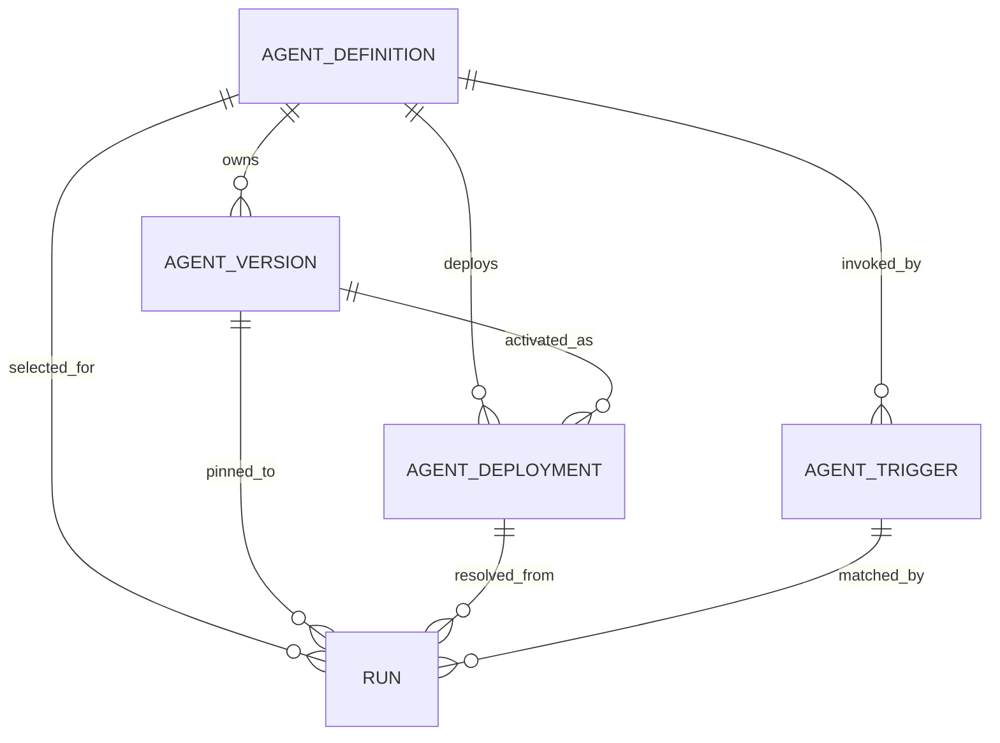

# Agent Catalog v1

## Scope

Add a tenant-scoped Agent control-plane foundation that represents the current implicit Agent as a stable definition with immutable versions, resolves the existing `@Agent` trigger, and pins every new Run to the exact published version it executes. This slice preserves the verified answer, citation, approval, ticket, OpenIM Bot, and Web workspace behavior.

It does not add Agent creation UI, arbitrary prompts, generic workflows, another model provider, Tool/Skill Registry, MCP Gateway, memory, multi-Agent orchestration, per-channel policy, per-Agent OpenIM users, canary traffic, or production fallback.

## Responsibilities and non-goals

The Catalog owns stable tenant Agent identity, immutable execution versions, the single production deployment pointer, mention-trigger mapping, activation audit, and the catalog references pinned to a Run. Agent Runtime still owns execution, Identity owns tenant/member/device authorization, OpenIM owns message delivery, ACL retrieval owns evidence authorization, and Action Executor owns approved business effects.

This v1 slice exposes no mutation API or administration UI. A host-only operator CLI performs validated publication and revision-fenced activation; it is not a network service. The slice does not introduce a generic execution engine, arbitrary provider routes, dynamic tools, Skill/MCP registration, memory, multi-Agent orchestration, per-Agent Bot provisioning, or a fallback Agent.

## Contracts and dependencies

- PostgreSQL migration `0008_agent_catalog.sql` and tenant-constrained catalog foreign keys.
- Durable OpenIM event ingestion and `agent.runs.source_event_id` deduplication.
- `GET /v1/agents` in `contracts/openapi/platform-v1.yaml`.
- Existing member/device OIDC authentication and deterministic tenant Bot identity.
- Agent Runtime's exact-version `RuntimeStore` contract and Intelligence Worker candidate request.
- Host-only `agent-catalog-admin` publication and activation operations described in `docs/runbooks/agent-catalog-operations.md`.

## Baseline replaced by this slice

- `event.go` previously recognized a literal `@agent` marker.
- `worker.go` previously fixed retrieval to purpose `agent_answer`, limit `5`, and permitted only `create_ticket`.
- `agent.runs` previously recorded no Agent or configuration version.
- `agent.bot_identities` intentionally maps one platform Agent Bot per tenant.

This prevents exact replay and makes future configuration edits unsafe because a queued Run could otherwise observe a different configuration from the one active when it was accepted.

## Domain model



### AgentDefinition

Stable tenant-owned product identity:

- `id`, `tenant_id`, immutable `slug`.
- Mutable `display_name` and `description` for presentation only.
- `status`: `active`, `disabled`, or `archived`.
- Nullable `created_by_member_id`, audit timestamps, and optimistic revision; null is reserved for the migration-owned built-in Agent.
- Unique `(tenant_id, slug)`.

Changing display fields does not create an execution version because they must not affect model behavior. `disabled` blocks new Run insertion. `archived` also blocks new deployments and triggers; history remains readable.

### AgentVersion

Immutable complete execution snapshot:

- `id`, `agent_id`, monotonically increasing `version_number`.
- `spec_schema_version` and canonical `spec` JSONB.
- SHA-256 `spec_checksum` over canonical JSON.
- Nullable `created_by_member_id`, `created_at`, and non-null `published_at`; null creator is reserved for the migration-owned built-in version.
- Unique `(agent_id, version_number)` and `(agent_id, spec_checksum)`.

The first supported specification is deliberately closed:

```json
{
  "runtime_kind": "knowledge_ticket_v1",
  "instructions": "Answer only from authorized evidence and abstain when evidence is absent.",
  "model_route": "gpt-5.6-terra",
  "retrieval": {
    "purpose": "agent_answer",
    "limit": 5
  },
  "allowed_action_types": ["create_ticket"],
  "max_model_attempts": 3
}
```

The value contains a logical model route, never a key or endpoint credential. Go validates the complete schema and semantics before insert. Every v1 AgentVersion is a published snapshot and PostgreSQL rejects all updates and deletes. A future editable draft is a separate entity, not a mutable AgentVersion. Unknown fields, runtime kinds, action types, and out-of-range limits fail closed.

### AgentDeployment

Mutable release pointer:

- `id`, `tenant_id`, `agent_id`, `slot`, `active_version_id`.
- v1 permits only `slot=production`.
- `activated_by_member_id`, `activated_at`, and optimistic revision.
- Unique `(tenant_id, agent_id, slot)`.

Activation is one transaction that verifies tenant ownership, version ownership, published status, supported schema, and checksum. Moving the pointer is a rollout or rollback; it never changes existing Runs.

### AgentTrigger

Tenant-scoped invocation mapping:

- `id`, `tenant_id`, `agent_id`.
- `trigger_type=mention_alias` and normalized `trigger_value=@agent`.
- `enabled`, timestamps.
- Unique `(tenant_id, trigger_type, trigger_value)`.

v1 supports one exact, case-insensitive text mention alias. Substring matches inside words are rejected. Trigger parsing extracts candidates; PostgreSQL resolution selects the authoritative tenant mapping.

## Run contract changes

Add the following non-null fields after migration backfill:

- `agent_id`
- `agent_version_id`
- `agent_deployment_id`
- `agent_trigger_id`
- `agent_spec_checksum`

The Run stores the checksum as tamper evidence but the version row remains authoritative. On claim, the Worker loads by `agent_version_id`, verifies the checksum, validates the supported schema, then derives retrieval and action policy. A mismatch or unsupported specification fails the Run before retrieval or model invocation.

## Runtime flow

1. Parse an accepted OpenIM text event into a normalized mention candidate and prompt without choosing a default Agent.
2. In the Run insertion transaction, resolve tenant trigger, active definition, `production` deployment, and published version.
3. Insert the Run with all four catalog references and checksum under the existing unique `source_event_id`.
4. Commit the source Kafka offset only after the Run or durable rejection is committed.
5. Claim the Run using the existing fencing lease.
6. Load the exact immutable version stored on the Run and validate checksum/schema.
7. Execute the existing `knowledge_ticket_v1` retrieval, candidate, citation, reply, approval, and action path using values from that version.
8. Deployment changes affect only Runs inserted after the activation transaction.

## API and Web boundary

The bounded public surface is:

- `GET /v1/agents`: list active Agent definitions available to the authenticated tenant member, including ID, display name, description, trigger alias, production version number, and platform Bot user ID.
- Extend `AgentWorkspace` and Run projection with `agent_id`, `agent_display_name`, `agent_version_number`, and `agent_spec_checksum`.

There is no public create, update, publish, delete, or arbitrary execute API in v1 because the required administrator authorization model and release UI are not yet admitted. The migration seeds the built-in Agent. The Web client obtains the trigger from the API instead of hardcoding it, while prompt ingress remains the official OpenIM SDK.

## Bot identity decision

Keep one deterministic platform Agent Bot per tenant for v1. Logical Agent selection occurs through the catalog and is shown in the Run projection; OpenIM sender identity remains the tenant Bot. This avoids Bot provisioning, group membership, contact-list, and credential growth while the control-plane semantics are established. Per-Agent OpenIM Bot identities require a later product and migration decision.

## Data ownership and state

The `agent` schema owns definitions, versions, deployments, triggers, Runs, and typed trigger rejections. The `audit` schema owns immutable deployment-activation events. A Run copies only the selected IDs and checksum; the immutable version row remains authoritative execution data. The Web client owns no Catalog state and reads the current projection on each workspace refresh.

## Migration

Migration `0008_agent_catalog.sql` executes in this order using `agent.definitions`, `agent.versions`, `agent.deployments`, and `agent.triggers`:

1. Create definitions, versions, deployments, and triggers with tenant foreign keys and constraints.
2. For every `identity.tenants` row, seed one `knowledge-agent` definition; mirror a disabled tenant as a disabled definition and disabled trigger.
3. Create version 1 from the current hard-coded behavior, canonicalize the spec, and store its checksum.
4. Create the `production` deployment and `@agent` trigger.
5. Add nullable catalog columns to `agent.runs` and backfill every historical Run deterministically by tenant.
6. Verify zero unresolved Runs, then add foreign keys and non-null constraints.
7. Add the database guard that prevents mutation/deletion of published versions.

Migration failure aborts the transaction. There is no default global Agent and no cross-tenant backfill.

## Invariants

- A Run has exactly one Agent, version, deployment, trigger, and checksum.
- Run creation and version selection are atomic.
- A Worker never resolves `latest`, `production`, or a mutable prompt after Run insertion.
- An AgentVersion cannot be edited or deleted.
- A deployment can point only to a published version of the same tenant and Agent.
- Unknown, disabled, archived, ambiguous, missing, or checksum-invalid catalog state never falls back to another Agent.
- New tools, actions, Skills, and MCP servers are unavailable until a new validated version explicitly references them.
- Current OpenIM Admin, model, database, and action credentials remain outside Agent specs and the Python Worker.

## Failure handling

| Failure | Required behavior |
| --- | --- |
| Unknown mention | Treat as non-trigger; do not create a Run |
| Known trigger with disabled Agent | Write a durable typed rejection; do not call the model |
| Missing deployment/version | Write a durable typed rejection; do not choose version 1 |
| Checksum/schema mismatch at execution | Mark Run failed with typed catalog error before retrieval/model |
| Concurrent deployment activation | Optimistic revision allows one commit; loser receives conflict |
| Activation after Run insertion | Existing Run keeps its stored version; new Run sees the new pointer |
| Catalog database unavailable | Do not commit Kafka offset until retry or durable rejection is possible |

Disabling an Agent blocks new Runs. Already pinned Runs continue under their immutable version so retry semantics remain stable. A separate platform kill switch may pause all Agent execution during an incident.

## Security and authorization

- All catalog rows are tenant-scoped and every lookup includes `tenant_id`.
- v1 exposes read-only catalog data to authenticated active members; mutation APIs are absent.
- Future effective permission is `member permission ∩ Agent policy ∩ resource ACL ∩ tool policy`; this slice keeps the current member and ACL rules unchanged.
- MCP annotations and Skill metadata are not authorization evidence.
- Specs reject secrets and arbitrary endpoint URLs.

## Observability

Run logs and support projection include Agent/version identity and checksum provenance. Deployment activation produces an immutable audit event containing old/new version IDs and actor. Metrics and traces remain a separately admitted observability slice; prompt content and credentials remain excluded from logs.

## Acceptance criteria

- Migration preserves every existing Run and the current `@Agent` behavior.
- Duplicate source event still creates exactly one Run pinned to one version.
- A trigger in tenant A cannot resolve tenant B's Agent or version.
- Switching production from version 1 to version 2 affects only later Runs.
- Reclaiming an older Run still executes version 1 after production moves to version 2.
- Rolling production back to version 1 creates later Runs pinned to version 1 without mutating history.
- Disabled Agent, missing deployment, invalid schema, and checksum mismatch make no retrieval, model, OpenIM reply, or action call.
- Existing Go, Python, Web, PostgreSQL integration, OpenIM contract, and real Agent workspace suites remain green.

## Implementation slices

1. **Catalog persistence and migration**: schema, seed/backfill, immutable version validation, repository tests.
2. **Run pinning**: trigger resolution transaction, Run fields, Worker exact-version loading, failure tests.
3. **Read projection**: `GET /v1/agents`, OpenAPI types, workspace provenance, Web trigger lookup.
4. **Release verification**: full tests, two-version switch/rollback integration test, real `.1` to `.2` OpenIM smoke.

Each slice updates this SDD and stops after its acceptance criteria. Administration, generic capabilities, and additional Agent types require new SDDs.

## Source evidence

- `platform/services/platform-api/internal/agent/event.go`
- `platform/services/platform-api/internal/agent/catalog.go`
- `platform/services/platform-api/internal/agent/catalog_store.go`
- `platform/services/platform-api/internal/agent/catalog_service.go`
- `platform/services/platform-api/internal/agent/store.go`
- `platform/services/platform-api/internal/agent/worker.go`
- `platform/services/platform-api/internal/agent/catalog_integration_test.go`
- `platform/services/platform-api/cmd/agent-catalog-admin/main.go`
- `platform/services/platform-api/internal/migrations/sql/0008_agent_catalog.sql`
- `platform/services/platform-api/internal/migrations/sql/0003_agent.sql`
- `platform/services/platform-api/internal/migrations/sql/0004_agent_bot_identity.sql`
- `platform/services/platform-api/internal/migrations/sql/0005_acl_retrieval.sql`
- `platform/services/platform-api/internal/migrations/sql/0007_approved_ticket_action.sql`
- `contracts/openapi/platform-v1.yaml`
- `docs/research/agent-platform-reference-analysis.md`
- `docs/runbooks/agent-catalog-operations.md`

## Verification evidence

- Migration `0008` applied to the real local PostgreSQL database; all existing Runs were backfilled, the built-in v1 deployment remained active, and no unresolved row was accepted.
- A rollback-only PostgreSQL integration test verified v1 pinning, duplicate source-event deduplication, unknown-trigger ignore, disabled-trigger durable rejection, v1-to-v2 activation, old-Run stability, v2-to-v1 rollback, two activation audit events, tenant-bound Run lookup, and update/delete rejection for published versions. The transaction left no v2 row behind.
- Go package tests passed with the real PostgreSQL integration URL; the complete Go suite also passed without the integration environment.
- Intelligence Worker tests passed 9 cases, including unconfigured model-route and disallowed-action failure without a provider call.
- Web tests passed 75 cases; typecheck and production build passed with Catalog-derived trigger text, strict response validation, bot-identity matching, and visible Run version provenance.
- Clean release `9a6ffee` was verified by `SHA256SUMS`, deployed on Node2, and checked against the live `/proc/<MainPID>/exe` paths. An obsolete `90-device-e2e.conf` systemd override that had kept the old Platform API binary while reporting the new environment version was removed; deployment scripts now fail on any live executable mismatch.
- Host-only publication created immutable v2 checksum `sha256:63f9ec43df6dc1b6a8478b79df697737aaaaa919750f6f20f6feb0adff8bea5e`. Real Run `5b2af0bc-0dd5-413a-8818-83529102b02b` pinned v2 and completed ACL-RAG, DeepSeek, citation persistence, and OpenIM reply. After revision-fenced rollback, Run `e888682e-a44b-425f-88ef-b86c1e1909c8` pinned v1, while the earlier Run remained v2 and production returned to v1.
- Node2 ACL regression produced authorized cited Run `b3c3fef2-6eec-4190-915c-371b54613fd9`, revoked no-evidence Run `cf841794-4884-4a99-b2c3-13bf8170a6d7`, and no-match abstention Run `300d63e2-016a-4649-acee-55691e4bc180`.
- Approved-action regression kept zero effects before approval, rejected a wrong digest, and converged duplicate approval on Execution `5b600ed2-5e28-4c76-99bf-1563a5c5bac2` with one idempotent ticket effect.
- The Agent workspace E2E displayed `Enterprise Agent · v1`, citation and ticket state on desktop/mobile with no overflow, failed HTTP response, console error, Token persistence, or malformed Catalog acceptance. The complete seven-scenario Node2 browser suite passed serially in 106.5 seconds.

## Open questions deferred from v1

- Which enterprise roles may create, publish, disable, and roll back Agents?
- Should a later release add `staging`, tenant cohorts, or percentage canaries?
- When does an Agent require its own OpenIM user rather than the shared tenant Bot?
- How are ToolDefinition and Skill package signatures, versions, risk policies, and revocations represented?
- Which evaluation gates are mandatory before production activation?
