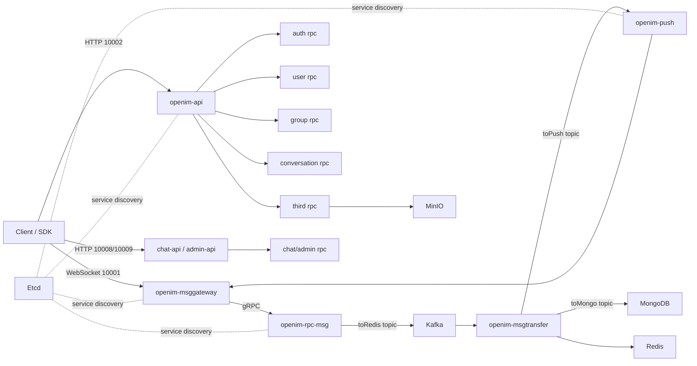

# OpenIM IM 系统后端面试材料

维护日期：2026-07-04

本文档用于维护基于 OpenIM 项目的后端面试表达、简历写法、架构讲解、压测结论和常见追问。表述边界要清楚：这是基于开源 OpenIM 的源码分析、私有化部署、压测验证与工程化改造，不要包装成“从零自研完整 IM 系统”。

## 1. 项目定位

### 1.1 一句话介绍

基于 OpenIM 搭建了一套私有化 IM 实验系统，完成核心服务端、业务层 Chat、跨平台 SDK、Docker Compose 部署和压测工具链梳理；重点分析了长连接网关、消息 RPC、Kafka 异步管道、消息转储、Redis 热缓存、MongoDB 持久化和在线/离线推送链路。

### 1.2 技术栈

- 后端语言：Go
- 通信协议：WebSocket、HTTP、gRPC、Protocol Buffers
- 核心中间件：MongoDB、Redis、Kafka、Etcd、MinIO
- 可观测性：Prometheus、Grafana、Alertmanager、Node Exporter
- 部署方式：Docker Compose，后续可迁移到 Kubernetes/Helm
- 压测工具：官方 `openim-sdk-core/msgtest`，本项目增加了多目标参数、指标汇总和退出控制

### 1.3 项目边界

可以说：

- 我做了 OpenIM 的私有化部署、源码级链路分析、压测工具改造和容量验证。
- 我梳理了从 SDK 长连接发送消息到服务端入队、异步落库、推送的完整链路。
- 我结合压测数据定位单机 compose 模式下的消息吞吐上限和下一步瓶颈方向。

不要说：

- 不要说整个 OpenIM 是自己从零写的。
- 不要把单机 compose 压测结果说成生产集群 SLA。
- 不要把 `SendReqWaitResp` 成功等同于“所有接收方都已收到消息”。

## 2. 简历写法

### 2.1 项目名称

OpenIM 私有化部署与 IM 消息系统压测分析

### 2.2 简历短版

基于 OpenIM 搭建私有化 IM 实验环境，完成核心服务端、Chat 业务层、跨平台 SDK 与 Docker Compose 部署链路梳理；分析 WebSocket 网关、消息 RPC、Kafka 异步队列、Redis 热缓存、MongoDB 持久化和推送链路，并基于官方 `msgtest` 改造压测工具，验证单机 compose 模式下五万级长连接建立能力和约 9k msg/s 的单聊消息入口吞吐。

### 2.3 简历项目经历版本

项目：OpenIM 私有化 IM 系统部署与压测验证

项目描述：

基于开源 OpenIM 构建 IM 后端实验环境，系统包含长连接网关、消息 RPC、用户/群组/好友/会话服务、消息转储服务、推送服务和 Chat 业务层，依赖 MongoDB、Redis、Kafka、Etcd、MinIO 等中间件。项目目标是理解企业级 IM 消息链路、验证单机与多机实验环境容量，并沉淀可面试讲解的后端架构经验。

个人工作：

- 完成 OpenIM 生态源码梳理，区分 `open-im-server`、`chat`、`protocol`、`openim-sdk-core`、各端 SDK 和部署仓库职责。
- 基于 Docker Compose 部署 OpenIM 服务栈，处理多主机环境、健康检查、端口范围、文件描述符和压测进程清理问题。
- 追踪消息发送链路：SDK `SendReqWaitResp` -> `msggateway` -> `msg rpc` -> Kafka -> `msgtransfer` -> Redis/MongoDB -> `push`。
- 改造官方 `openim-sdk-core/msgtest` 压测工具，增加目标地址环境变量、发送结果统计、QPS/延迟指标和发送后自动退出能力。
- 完成单聊消息吞吐测试，单机 compose 目标在零客户端失败条件下达到约 8k-9k msg/s，并观察到 sender 增加后延迟显著增长的瓶颈特征。
- 设计并执行五万级长连接建立测试，沉淀 Windows/Linux 压测脚本和日志留存规范。

技术栈：

Go、WebSocket、gRPC、Protocol Buffers、Kafka、Redis、MongoDB、Etcd、MinIO、Docker Compose、Prometheus、Grafana。

### 2.4 更保守的简历量化写法

如果面试中不想被压测数据过度追问，可以写：

- 基于官方 SDK 压测工具完成万级连接和消息发送压测，验证单机 compose 模式下消息入口吞吐接近 9k msg/s，并输出压测报告。
- 分析 OpenIM 消息链路中的 Kafka、Redis、MongoDB 和 Push 服务瓶颈，为后续集群化扩展提供依据。

### 2.5 可以放在简历里的成果数据

当前本地证据：

- 单聊消息压测报告：`openim-bench/message-bench-summary-20260704.md`
- `.1 -> .5` 最优单路：`480000` 条消息，`0` 失败，约 `9530 msg/s`，平均延迟 `60ms`
- `.5 -> .2` 最优单路：`720000` 条消息，`0` 失败，约 `9038 msg/s`，平均延迟 `109ms`
- Windows 到 `.5` 的 5 万连接建立状态文件：`runs/node1-to-node5-online-50000-hold900-20260704-012618.status`

注意：在线连接测试的本地 900 秒状态文件只记录到 `held_sec=237`，因此简历中建议写“五万级连接建立能力验证”，不要写成“稳定保持 20 分钟 SLA”。

## 3. 面试讲解提纲

### 3.1 30 秒版本

我做的是基于 OpenIM 的 IM 后端部署和压测分析。系统核心是 Go 写的长连接网关、领域 RPC、Kafka 异步消息管道、Redis 热缓存、MongoDB 持久化和 Push 服务。客户端通过 SDK 建 WebSocket 长连接，消息进入 `msggateway` 后调用 `msg rpc`，再写入 Kafka，由 `msgtransfer` 分配 seq、写 Redis 和 MongoDB，最后触发在线/离线推送。我重点做了源码链路梳理、Docker Compose 部署、官方压测工具改造和消息吞吐测试。

### 3.2 1 分钟版本

这个项目我主要从三个层面理解：第一是服务拆分，OpenIM 把入口网关、API、消息、用户、群组、会话、推送拆成多个 Go 服务，通过 Etcd 做服务发现。第二是消息链路，发送消息不是同步完成所有工作，而是先进入 Kafka，再由 `msgtransfer` 异步完成 seq 分配、Redis 热缓存、MongoDB 持久化和 push 触发。第三是压测验证，我基于官方 `msgtest` 做了参数化和指标统计，验证单机 compose 模式下单聊发送大约在 8k-9k msg/s 后延迟开始明显升高。

### 3.3 3 分钟版本

我会先讲架构：客户端通过 SDK 建 WebSocket 长连接，连接入口是 `openim-msggateway`。HTTP 管理和业务接口走 `openim-api` 和 `chat-api`。服务内部使用 gRPC，按 auth、user、group、friend、conversation、msg、third 等领域拆分。Etcd 负责注册发现，Redis 负责在线状态、Token、seq 和热缓存，Kafka 负责异步消息管道，MongoDB 负责最终持久化，MinIO 负责文件对象存储。

然后讲消息链路：SDK 调用 `SendReqWaitResp`，网关收到消息后调用消息 RPC。`msg rpc` 负责基础校验、会话路由和按单聊/群聊/通知类型分发，然后把消息写入 Kafka 的 `toRedis` topic。`msgtransfer` 消费后分配会话 seq，把消息写到 Redis 缓存，再发送到 `toMongo` 做异步持久化，同时发送到 `toPush` 触发在线推送。群消息的压力主要不在入口写 Kafka，而在后续 fanout、在线路由、推送过滤和带宽。

最后讲压测：我没有只看能连多少人，而是区分连接数压测和消息处理能力压测。连接数测试验证 WebSocket 和系统端口/文件描述符能力；消息压测用官方 SDK 长连接路径，统计成功数、失败数、QPS、平均/最大延迟。单机 compose 环境下，两个目标服务的单聊发送都在约 9k msg/s 附近出现平台期，继续增加 sender 吞吐提升不明显但延迟上涨，说明下一步要看 Kafka 分区、msgtransfer 消费、Redis/Mongo 写入和 push fanout。

## 4. 架构总览



## 5. 核心仓库和模块

| 模块 | 仓库/目录 | 作用 |
| --- | --- | --- |
| IM 核心服务端 | `open-im-server` | 长连接、API、RPC、消息转储、推送 |
| Chat 业务层 | `chat` | 登录注册、后台管理、产品层 API |
| 协议层 | `sources/openimsdk/protocol` | protobuf、常量、跨端协议 |
| SDK 核心 | `sources/openimsdk/openim-sdk-core` | 长连接、消息 API、本地缓存、压测工具 |
| Docker 部署 | `openim-docker-v3.8` | compose、镜像、中间件、观测组件 |
| 压测总结 | `openim-bench/message-bench-summary-20260704.md` | 消息压测结果 |

## 6. 源码锚点

| 链路 | 文件 | 说明 |
| --- | --- | --- |
| SDK 发送 | `sources/openimsdk/openim-sdk-core/msgtest/module/msg_sender.go` | 压测端通过 `SendReqWaitResp` 走真实长连接发送 |
| 网关入口 | `open-im-server/internal/msggateway/message_handler.go` | WebSocket 收到消息后转为 RPC 请求 |
| 消息 RPC | `open-im-server/internal/rpc/msg/send.go` | 区分单聊、群聊、通知消息并写 Kafka |
| Kafka producer | `open-im-server/pkg/common/storage/controller/msg.go` | `MsgToMQ` 把消息写入消息队列 |
| 消息转储 | `open-im-server/internal/msgtransfer/online_history_msg_handler.go` | 消费消息、写缓存、触发落库和推送 |
| seq/缓存 | `open-im-server/pkg/common/storage/controller/msg_transfer.go` | `BatchInsertChat2Cache` 分配 seq 并写 Redis |
| 推送消费 | `open-im-server/internal/push/push_handler.go` | 消费 push topic，处理在线/离线推送 |
| 群 fanout | `open-im-server/internal/push/push_handler.go` | `Push2Group` 处理群成员推送 |
| Mongo 消息模型 | `open-im-server/pkg/common/storage/database/mgo/msg.go` | 消息持久化实现 |

## 7. 中间件选型

| 中间件 | 在 OpenIM 中的作用 | 面试表达 |
| --- | --- | --- |
| MongoDB | 用户、群、好友、会话、消息历史、Chat 业务数据持久化 | 最终持久化层，适合消息文档和灵活字段 |
| Redis | Token、在线状态、seq、消息热缓存、用户/群/好友缓存 | 热路径组件，降低 Mongo 查询和写入压力 |
| Kafka | `toRedis`、`toMongo`、`toPush`、`toOfflinePush` 消息队列 | 削峰填谷，解耦入口、落库和推送 |
| Etcd | 服务发现、配置中心 | 支撑 RPC 服务注册发现和动态配置 |
| MinIO | 图片、视频、语音、文件对象存储 | 大对象不进数据库，消息只保存 URL/元数据 |
| Prometheus/Grafana | 服务和主机指标 | 压测时定位网关、Kafka、Redis、Mongo、push 瓶颈 |

### 7.1 为什么没有选择 PostgreSQL

不是 PostgreSQL 不行，而是 OpenIM 当前实现更偏 MongoDB 文档模型：

- 消息体字段灵活，文本、图片、语音、视频、自定义消息结构不完全一致。
- 常见查询是按 `conversationID + seq/time` 拉取历史消息，不是复杂多表 join。
- 消息发送链路已经通过 Kafka 异步化，MongoDB 更多承担最终落库，不是同步交易中心。
- 当前源码实际依赖 `go.mongodb.org/mongo-driver`，存储实现集中在 `database/mgo`，没有 PostgreSQL 适配层。

如果要换 PostgreSQL，需要重新实现存储接口、设计 schema、分区表、索引、迁移脚本和压测验证，不是替换 compose 镜像就能完成。

### 7.2 Redis 和 MongoDB 的区别

MongoDB 存长期数据，Redis 存热数据。MongoDB 负责最终可查的用户、群、会话、历史消息；Redis 负责在线状态、Token、seq、未读/读序列、最近消息缓存。Redis 快但内存贵，不适合承载全部历史消息；MongoDB 查询和写入延迟更高，但适合持久化。

### 7.3 Kafka 和数据库的区别

Kafka 不是业务数据库，而是事件日志/消息队列。它适合按顺序写入和消费消息流，解决削峰和解耦；不适合像数据库一样做复杂条件查询。OpenIM 用 Kafka 把“发送入口”和“落库/推送”拆开。

## 8. 消息链路详解

### 8.1 建连和在线状态

客户端 SDK 和 `openim-msggateway` 建立 WebSocket 长连接。网关负责维护连接，用户在线状态和连接相关信息会借助 Redis/服务发现进行查询和同步。压测中大量在线连接主要考验：

- 客户端本机动态端口范围
- 服务端文件描述符限制
- 网关连接管理能力
- 网络和内核 TCP 参数
- Redis 在线状态读写压力

### 8.2 单聊消息发送

```text
SDK SendReqWaitResp
  -> openim-msggateway SendMessage
  -> openim-rpc-msg SendMsg
  -> Kafka toRedis
  -> openim-msgtransfer
  -> Redis 分配 seq / 写热缓存
  -> Kafka toMongo
  -> MongoDB 持久化
  -> Kafka toPush
  -> openim-push
  -> 在线用户所在 gateway
```

要点：

- 入口服务不直接同步完成所有落库和推送。
- `SendReqWaitResp` 成功表示服务端完成该请求的响应，不代表所有接收方最终都收到。
- Kafka 解耦后，可以横向扩展 msgtransfer 和 push，但要关注分区数和消费组。

### 8.3 群聊消息发送

群消息的入口链路和单聊类似，但后续多了群成员扩散和在线/离线过滤。大群场景的核心压力通常在：

- 群成员列表查询和缓存
- fanout 目标用户数量
- 在线用户路由
- push 服务处理能力
- 网关下发带宽
- 离线推送过滤和第三方推送调用

面试时可以说：大群不是“发一条消息”这么简单，服务端要决定哪些成员在线、在哪个网关、是否需要离线推送、是否免打扰、是否同步给发送端其他端。

### 8.4 历史消息拉取

历史消息一般按会话和 seq 拉取。Redis 保存热消息，MongoDB 保存持久化消息。客户端本地 SDK 通常也有本地缓存，实际产品里会形成：

```text
本地 SDK 缓存 -> Redis 热缓存 -> MongoDB 历史消息
```

这样可以减少服务端存储压力和网络开销。

## 9. 关键设计点

### 9.1 seq 为什么重要

IM 消息需要在会话内有稳定顺序。seq 可以用于：

- 客户端增量同步
- 历史消息分页
- 消息去重和补偿
- 已读位置和未读数计算
- 多端同步

如果没有 seq，只靠时间戳排序会受到时钟偏移、并发写入和网络乱序影响。

### 9.2 为什么要异步落库

同步落库的简单链路是：

```text
收到消息 -> 写数据库 -> 推送 -> 返回
```

这种方式实现简单，但入口延迟受数据库和推送影响。OpenIM 的链路是：

```text
收到消息 -> 写 Kafka -> 返回/继续处理 -> 异步落库和推送
```

好处是入口抗突发能力更强，落库和推送可以独立扩容；代价是链路更复杂，需要处理消息堆积、重复消费、幂等和可观测性。

### 9.3 如何保证可靠性

面试回答可以分层：

- 客户端层：消息有 `clientMsgID` / `serverMsgID`，失败可重试。
- 入口层：服务端校验后写 Kafka，避免直接依赖 Mongo 写入延迟。
- 队列层：Kafka 保存消息流，消费者按 group 维护 offset。
- 消费层：msgtransfer 写 Redis/Mongo 和 push topic，失败需要重试或告警。
- 存储层：MongoDB 持久化历史消息，Redis 只做热缓存。

不要把它说成“绝对不丢消息”。更准确是：通过消息 ID、队列、持久化、重试和补偿机制提高可靠性，具体语义要看生产配置和异常处理。

### 9.4 如何做幂等

典型思路：

- 客户端生成 `clientMsgID`，服务端生成 `serverMsgID`。
- 存储层对消息 ID 或会话 seq 做唯一性约束。
- 重试时如果发现同一消息已处理，直接返回已有结果。
- 消费 Kafka 时，下游写入要能处理重复消息。

OpenIM 当前源码中很多逻辑围绕消息 ID、seq 和 doc/index 查询展开，面试时可以从这个方向解释。

### 9.5 未读数怎么做

常见做法是每个会话维护最大 seq，每个用户维护已读 seq：

```text
unread = conversationMaxSeq - userReadSeq
```

这样比逐条消息标记未读更高效。群聊还要考虑入群时间、退群时间、免打扰、清空会话、删除本地消息等边界。

### 9.6 多端同步怎么做

同一个用户可能在 Web、iOS、Android、PC 多端在线。服务端需要：

- 记录用户多平台在线状态。
- 发送消息后同步给自己的其他端。
- 已读、撤回、删除、会话变更等通知也要同步。
- 离线端上线后根据 seq 增量拉取。

## 10. 压测内容

### 10.1 压测目标

本项目把压测拆成两类：

- 在线连接压测：验证 WebSocket 连接建立、端口、文件描述符、网关连接管理。
- 消息处理压测：验证发送入口、Kafka、msgtransfer、Redis、MongoDB、push 的整体吞吐。

### 10.2 压测方法

基于官方 `openim-sdk-core/msgtest`，走 SDK/WebSocket 真实发送路径，不是简单 HTTP 打接口。改造点：

- 支持 `OPENIM_API_ADDR`、`OPENIM_WS_ADDR`、`OPENIM_TEST_IP` 指定目标服务。
- 增加 per-second 和 final 指标：成功数、失败数、QPS、平均/最大延迟、延迟桶。
- 支持消息发送完成后自动退出，便于自动化收集结果。
- Windows 和 Linux 分别提供包装脚本，统一输出 status 和日志。

### 10.3 当前消息压测结论

单机 Docker Compose 目标环境下，单聊 SDK/WebSocket 发送路径：

| 路径 | 最优记录 | 结论 |
| --- | --- | --- |
| `.5 -> .2` | `720000` OK，`0` failed，约 `9038 msg/s`，avg `109ms` | `.2` 目标约 8k-9k msg/s 后进入平台期 |
| `.1 -> .5` | `480000` OK，`0` failed，约 `9530 msg/s`，avg `60ms` | `.5` 目标约 9k msg/s 后继续加 sender 收益下降 |

解释：

- 这说明单机 compose 环境的入口消息吞吐大约在 9k msg/s 附近。
- sender 从 800 增加到 1200 后吞吐没有线性增长，平均延迟明显升高。
- 下一步应拆分观察 Kafka lag、msgtransfer CPU、Redis 延迟、Mongo 写入和 push 处理。

### 10.4 在线连接压测结论

本地记录显示 Windows 到 `.5` 的 5 万连接测试达到了 `conn=50000`，并且 `current-100k-run.txt` 记录了双路 5 万协调测试：

```text
RUN1=node1-to-node5-online-50000-hold900-20260704-012618
RUN5=node5-to-node2-online-50000-hold900-20260704-012618
COORDINATED=1
```

但本地 900 秒状态文件没有完整记录到 `hold_complete`，因此简历里建议保守写“五万级连接建立验证”和“设计过双路 5 万连接方案”，不要把它写成生产级 10 万在线稳定承诺。

### 10.5 压测局限

- 当前是单机 compose 模式，不是生产集群。
- MongoDB、Redis、Kafka 都是单节点，不能代表集群容量。
- `.5` 在部分双路测试中既做客户端又做服务端，结果会受共享资源影响。
- 单聊发送测试不等价于大群 fanout 测试。
- 客户端观测到发送成功，不等于所有接收端都完成展示。

## 11. 高频面试题和回答

### Q1：你这个项目到底做了什么？

我做的是 OpenIM 的私有化部署、源码链路分析和压测验证。我把 OpenIM 生态仓库拉下来，重点分析 `open-im-server`、`chat`、`protocol` 和 `openim-sdk-core`，然后基于 Docker Compose 搭建实验环境，改造官方压测工具，验证长连接和消息吞吐，并梳理出消息从 SDK 到网关、RPC、Kafka、Redis/Mongo 和 push 的完整链路。

### Q2：为什么 IM 要用 WebSocket？

IM 需要服务端主动下发消息，如果只用 HTTP 轮询，延迟和资源消耗都比较差。WebSocket 建立长连接后，服务端可以主动推送新消息、通知、已读、撤回等事件。代价是服务端要维护大量连接，需要关注连接管理、心跳、断线重连、在线状态和网关扩容。

### Q3：消息发送成功后一定送达了吗？

不一定。发送成功通常表示消息已经被服务端接收并完成当前请求处理，可能已经进入 Kafka 或后续链路。但接收方是否在线、push 是否成功、客户端是否展示，都属于后续阶段。严谨说法是：发送成功不是端到端已读，也不是所有接收方已送达。

### Q4：Kafka 在这里解决什么问题？

Kafka 把入口发送和后续落库/推送解耦。没有 Kafka 时，发送接口要同步写数据库、更新缓存、推送用户，任何一个环节慢都会拖慢入口。用了 Kafka 后，入口可以先把消息放入队列，后续由 `msgtransfer` 和 `push` 异步消费，具备削峰、解耦和横向扩展能力。

### Q5：Redis 在这里是缓存还是数据库？

Redis 是热路径组件，不是最终历史数据库。它缓存 Token、在线状态、用户/群/好友信息、消息热数据、seq 和读序列等。最终历史消息还是要落 MongoDB。Redis 的价值是低延迟和高并发，但不能把所有长期数据都压到 Redis。

### Q6：为什么消息要有 seq？

seq 是会话内顺序编号，用于保证客户端按顺序同步消息，也用于分页拉历史、增量同步、未读数计算和去重补偿。如果只靠时间戳，遇到并发发送、网络乱序、服务端时钟问题时很难保证稳定顺序。

### Q7：大群消息的瓶颈在哪里？

大群瓶颈通常不在入口收到一条消息，而在 fanout。服务端要查群成员、判断在线状态、过滤免打扰、找到用户所在网关、执行在线推送或离线推送。如果是 5 万人大群，一条消息可能引发大量下发和过滤操作，push 服务、Redis、网关带宽和客户端处理都会成为瓶颈。

### Q8：如何扩展到更高并发？

可以从几层做：

- 网关层：多 `msggateway` 实例，负载均衡，按用户或连接分散。
- 队列层：增加 Kafka 分区和 broker，提升并行消费能力。
- 消费层：扩展 `msgtransfer` 和 `push` 实例。
- 缓存层：Redis Cluster 或分片，处理热点 key。
- 存储层：MongoDB 副本集/分片，消息按会话或时间分片。
- 系统层：调大文件描述符、端口范围、TCP 参数，隔离压测客户端和服务端。
- 观测层：监控 Kafka lag、Redis 延迟、Mongo 写入、网关连接数和 push QPS。

### Q9：为什么没有用 PostgreSQL？

OpenIM 当前实现选择 MongoDB，因为消息体更像文档数据，字段灵活，查询主要按会话和 seq 拉取，不是复杂 join。PostgreSQL 也能做，尤其可以用 JSONB 和分区表，但要重新设计 schema、索引和存储适配层。当前源码没有 PG 适配，直接换数据库不现实。

### Q10：如果让你自己设计 IM 后端，你会怎么设计？

我会保留类似的核心思路：WebSocket 网关负责连接，业务 API 和消息入口分离，消息进入 Kafka 后异步落库和推送；Redis 存在线状态、seq 和热缓存；持久层可以根据团队能力选择 MongoDB 或 PostgreSQL。关键是把消息入口、顺序分配、落库、推送、离线补偿、监控告警分清楚。

## 12. 面试官可能深挖的点

### 12.1 如果 Kafka 堆积怎么办？

先确认是生产速度过快还是消费速度过慢。观察 Kafka lag、消费者 CPU、Redis/Mongo 延迟和 push 耗时。如果是消费瓶颈，可以增加分区和消费者实例；如果是下游慢，要优化 Redis/Mongo 写入、批处理、索引和 push fanout。必要时做限流和降级，比如先保证消息落库，延迟处理离线 push。

### 12.2 如果 Redis 挂了怎么办？

Redis 挂了会影响 Token、在线状态、seq、热消息缓存等热路径。生产环境不能用单点 Redis，应使用主从/哨兵/集群。服务侧要区分强依赖和可降级数据：Token 和 seq 属于强依赖，用户资料缓存可以回源 MongoDB，在线状态可能短时间不准确。

### 12.3 如果 MongoDB 写慢怎么办？

先看写入是否在消息转储环节造成 Kafka lag。优化方向包括批量写、索引检查、按会话/时间分片、冷热数据分离、降低不必要字段更新、扩展 Mongo 副本集/分片。还要确认 Redis 热缓存是否能承受短时间回源。

### 12.4 如何处理离线消息？

消息最终落 MongoDB，用户离线时不一定需要逐条推送到客户端。用户重新上线后，可以根据本地最大 seq 向服务端拉增量消息。离线 push 只负责提醒，不是消息正文可靠传输的唯一来源。

### 12.5 如何处理重复消息？

客户端重试、Kafka 重平衡、消费者异常都可能导致重复。需要用消息 ID、会话 seq、数据库唯一约束或幂等写入来处理。客户端展示也要根据消息 ID 去重。

### 12.6 如何判断压测瓶颈？

不能只看客户端 QPS。要同时看：

- 客户端错误率和延迟分布
- 网关连接数和 CPU
- Kafka topic lag 和 broker I/O
- msgtransfer 消费速度
- Redis OPS、延迟、慢查询、内存
- MongoDB 写入耗时、锁、索引命中
- push 服务 QPS 和失败率
- 主机 CPU、内存、网络、磁盘

## 13. 高质量面试官追问题库

这一节不是背答案用的，而是用来判断面试官可能从哪些角度验证你是否真的理解 IM 系统。回答时优先结合 OpenIM 的实际链路，不要只背八股。

### 13.1 项目真实性与边界

| 问题 | 考察点 | 回答方向 |
| --- | --- | --- |
| 这个项目哪些是你自己做的，哪些是 OpenIM 原有能力？ | 项目真实性 | 明确说自己做的是源码梳理、部署、压测工具改造、链路分析和容量验证，不说从零自研 OpenIM |
| 你具体改过哪些代码或脚本？ | 工程落地 | 讲 `msgtest` 参数化、QPS/延迟统计、自动退出、Windows/Linux 包装脚本、多机部署脚本 |
| 你怎么证明自己不是只跑了一个 demo？ | 证据意识 | 讲源码锚点、部署版本、压测日志、message-bench-summary、连接状态文件 |
| 如果面试官让你现场画架构图，你会怎么画？ | 架构内化 | 先画 SDK -> msggateway -> msg rpc -> Kafka -> msgtransfer -> Redis/Mongo -> push |
| 这个项目和普通 CRUD 项目最大的区别是什么？ | 系统复杂度 | 强调长连接、消息顺序、异步链路、在线状态、大群 fanout、可靠性和压测 |

### 13.2 整体架构设计

| 问题 | 考察点 | 回答方向 |
| --- | --- | --- |
| 为什么要拆 `msggateway`、`msg rpc`、`msgtransfer`、`push`？ | 服务拆分 | 网关管连接，RPC 管校验和路由，transfer 管异步落库和 seq，push 管在线/离线推送，各自独立扩展 |
| 如果把发送、落库、推送都放在一个服务里会怎样？ | 解耦能力 | 简单但入口延迟高，数据库或推送慢会拖垮发送链路，扩容粒度也差 |
| `openim-api` 和 `msggateway` 的职责边界是什么？ | API/长连接分层 | API 处理 HTTP 管理和普通业务接口，gateway 处理 WebSocket 长连接和实时消息 |
| 为什么内部用 gRPC？ | RPC 设计 | 服务间调用强类型、性能较好、结合 protobuf 统一协议；也方便服务拆分和注册发现 |
| Etcd 在链路中是不是每条消息都会访问？ | 热路径识别 | 不是。Etcd 主要做服务发现和配置，不应成为每条消息的高频读写路径 |

### 13.3 长连接与在线状态

| 问题 | 考察点 | 回答方向 |
| --- | --- | --- |
| WebSocket 网关如何支撑大量连接？ | 长连接基础 | 多实例网关、连接状态管理、心跳、超时清理、文件描述符和内核参数调优 |
| 为什么客户端压测会遇到端口不够？ | TCP 基础 | 客户端每条出站 TCP 连接会占用一个本地临时端口，同一目标地址端口组合受动态端口范围限制 |
| 连接断开后在线状态如何保证不脏？ | 状态一致性 | 心跳、连接关闭回调、TTL、定期校正；Redis 在线状态要允许短暂不一致 |
| 多端登录时一个用户有几条连接？ | 多端模型 | 同一 userID 可能有 Web/iOS/Android/PC 多平台连接，服务端要按 platform 管理和推送 |
| 网关宕机时用户会发生什么？ | 故障恢复 | 该网关上的连接断开，客户端重连到其他网关；服务端需要清理旧在线状态 |

### 13.4 消息顺序与可靠性

| 问题 | 考察点 | 回答方向 |
| --- | --- | --- |
| 单聊消息如何保证顺序？ | seq 设计 | 以会话为粒度分配递增 seq，客户端按 seq 拉取和展示 |
| 群聊消息如何保证顺序？ | 会话级顺序 | 群会话也需要独立 seq；顺序通常是会话内顺序，不是全局顺序 |
| 为什么不用时间戳排序？ | 分布式系统基础 | 时间戳受并发、时钟偏移、网络乱序影响，不能作为可靠顺序依据 |
| 发送成功代表什么？ | 语义边界 | 代表服务端处理了发送请求，可能已入队；不代表所有接收方已送达或已读 |
| 如何处理客户端重试导致的重复消息？ | 幂等 | 用 clientMsgID/serverMsgID、会话 seq、唯一约束或幂等写入去重 |
| Kafka 消费重复会不会导致重复落库？ | at-least-once 语义 | Kafka 常见是至少一次消费，下游 Mongo/Redis 写入要考虑幂等 |
| 消息入 Kafka 成功但 Mongo 写失败怎么办？ | 异步可靠性 | 观察 Kafka lag/错误日志，消费者重试，必要时补偿或人工修复；发送成功不等于落库一定完成 |
| 如果接收方离线，消息怎么补？ | 离线同步 | 消息落库后，用户上线按本地最大 seq 增量拉取；离线 push 只是提醒 |

### 13.5 Kafka 深挖

| 问题 | 考察点 | 回答方向 |
| --- | --- | --- |
| Kafka topic 为什么拆成 `toRedis`、`toMongo`、`toPush`？ | 异步阶段拆分 | 不同消费者职责不同，缓存/落库/推送可以独立扩展和观测 |
| Kafka partition key 应该怎么选？ | 顺序与并行度 | 通常按 conversationID 或类似会话 key，保证同一会话顺序，同时不同会话并行 |
| 分区数太少会怎样？ | 容量上限 | 消费并行度不足，msgtransfer/push 扩容也吃不满 |
| 分区数太多会怎样？ | 运维成本 | broker 元数据、文件句柄、rebalance 成本变高，小集群没必要盲目加 |
| Kafka 堆积时你先看什么？ | 排障路径 | 看 lag、生产速率、消费速率、消费者错误、Redis/Mongo/push 延迟 |
| 为什么不用 Redis Stream 替代 Kafka？ | 选型比较 | Redis Stream 可做轻量队列，但 Kafka 更适合高吞吐、持久日志、消费组、回放和独立扩展 |
| Kafka 挂了系统会怎样？ | 依赖风险 | 发送入口无法正常入队，消息链路受阻；生产要多 broker、副本、监控和降级策略 |

### 13.6 Redis 深挖

| 问题 | 考察点 | 回答方向 |
| --- | --- | --- |
| Redis 在这个项目里哪些数据不能轻易丢？ | 数据分级 | Token、seq、在线状态属于强依赖或准强依赖；用户资料缓存可回源 |
| Redis 热 key 可能出现在哪里？ | 性能风险 | 大群成员、热门会话 seq、在线状态、推送路由等 |
| 大 key 可能出现在哪里？ | 缓存建模 | 群成员列表、超大在线集合、消息缓存列表；需要拆分、分页或压缩 |
| Redis 挂了为什么不能完全靠 MongoDB？ | 热路径延迟 | MongoDB 可回源部分资料，但在线状态、seq、Token 校验会严重受影响 |
| Redis Cluster 会带来什么问题？ | 集群化细节 | key hash、跨 slot 操作限制、热点分片、客户端路由和故障转移 |
| 缓存和数据库不一致怎么办？ | 一致性策略 | 接受短暂不一致，依靠 TTL、删除缓存、消息通知、本地缓存失效和回源修正 |

### 13.7 MongoDB / 存储深挖

| 问题 | 考察点 | 回答方向 |
| --- | --- | --- |
| 为什么消息适合文档模型？ | 数据模型 | 消息体类型多、字段变化大，按会话/seq 查询，复杂 join 少 |
| MongoDB 消息表最重要的索引是什么？ | 索引意识 | 至少要围绕会话、doc_id、seq/time 查询设计索引；具体以源码模型为准 |
| 单个 Mongo 文档过大怎么办？ | 文档限制 | 消息需要按会话和 seq 分段存储，不能无限往一个文档塞 |
| 历史消息越来越多怎么扩展？ | 数据增长 | 冷热分离、按时间归档、Mongo 分片、历史消息压缩或对象存储归档 |
| 为什么不用 PostgreSQL？ | 选型边界 | PG 可以做，但要重写 schema 和存储适配；OpenIM 当前实现是 Mongo 驱动和 mgo 存储 |
| 如果用 PostgreSQL 你会怎么建模？ | 迁移设计 | messages 表按 conversation/time 分区，JSONB 存扩展体，索引 conversation_id + seq |

### 13.8 大群与推送

| 问题 | 考察点 | 回答方向 |
| --- | --- | --- |
| 5 万人大群发一条消息，服务端实际做了什么？ | fanout 认知 | 查成员、过滤权限/免打扰、判断在线、找网关、在线推送、离线提醒 |
| 大群应该写扩散还是读扩散？ | 架构权衡 | 小群可写扩散，大群更偏读扩散或混合模式，否则写放大会很严重 |
| OpenIM 当前大群瓶颈更可能在哪里？ | 项目结合 | push fanout、Redis 群成员/在线状态、网关下发带宽、Kafka 消费并行度 |
| 如何避免一个大群拖垮整个系统？ | 隔离策略 | 限流、队列隔离、大群专用 topic/消费者、分批推送、降级离线 push |
| 离线 push 和在线消息推送有什么区别？ | 推送语义 | 在线推送是消息同步，离线 push 是提醒；真正消息内容仍以后续拉取/同步为准 |
| 撤回消息在大群里怎么处理？ | 控制消息 | 撤回本质是控制消息，需要同步给在线端并持久化状态，离线端上线后也要同步 |

### 13.9 未读数、多端同步和会话

| 问题 | 考察点 | 回答方向 |
| --- | --- | --- |
| 未读数为什么不能逐条消息统计？ | 性能 | 高并发下逐条统计成本高，通常用 conversation max seq 和 user read seq 计算 |
| 清空会话和删除消息有什么区别？ | 产品语义 | 清空通常是用户本地视角的 read/clear position，删除可能是本地删除或服务端状态变化 |
| 多端已读如何同步？ | 多端一致性 | 一个端上报 read seq，服务端更新后向同用户其他端同步会话变更 |
| 用户退群后还能不能看到历史消息？ | 业务规则 | 取决于产品策略，需要结合入群/退群 seq 或时间点过滤 |
| 免打扰会不会影响未读数？ | 业务细节 | 可能影响 push 和总未读角标展示，但不一定影响会话内未读 |

### 13.10 安全与权限

| 问题 | 考察点 | 回答方向 |
| --- | --- | --- |
| 用户能不能伪造 sendID 给别人发消息？ | 鉴权 | 服务端必须根据 token/session 校验发送者身份，不能只信客户端字段 |
| 群消息如何校验发送权限？ | 权限模型 | 校验用户是否群成员、是否被禁言、群是否解散、用户是否被封禁 |
| 文件上传为什么不能直接让客户端随便传？ | 对象存储安全 | 需要鉴权、大小限制、类型限制、URL 有效期或访问控制 |
| 管理后台接口怎么保护？ | 后台安全 | 管理员 token、角色权限、审计日志、敏感操作二次确认 |
| IM 系统如何做限流？ | 风控 | 用户级、IP 级、设备级、群级、接口级限流，异常行为封禁 |

### 13.11 压测与容量规划

| 问题 | 考察点 | 回答方向 |
| --- | --- | --- |
| 你说 9k msg/s，这个数是怎么测出来的？ | 指标可信度 | 官方 SDK 长连接路径，统计成功/失败/QPS/延迟；单机 compose、单聊、默认文本消息 |
| 这个 9k msg/s 能代表生产能力吗？ | 边界意识 | 不能直接代表生产集群，只代表当前硬件和单机 compose 实验条件 |
| 为什么连接数压测不等于消息处理能力？ | 压测分类 | 连接数看网关/TCP/端口/FD，消息吞吐看入口、Kafka、Redis、Mongo、push |
| 你怎么确认瓶颈不是压测客户端？ | 实验设计 | 分离客户端和服务端，观察客户端 CPU/端口/连接错误，多客户端对照 |
| 如果 QPS 上不去但失败数为 0，说明什么？ | 性能判断 | 系统可能进入排队状态，吞吐平台期，延迟上升比错误更早暴露瓶颈 |
| 你下一轮压测会怎么做？ | 实验能力 | 分离服务端/客户端，补 Kafka lag、Redis、Mongo、push 指标，做群 fanout 和多实例对比 |
| 为什么要压大群而不是只压单聊？ | 业务真实性 | 单聊主要测入口和落库，大群会暴露 fanout、在线路由和推送带宽瓶颈 |

### 13.12 生产化与高可用

| 问题 | 考察点 | 回答方向 |
| --- | --- | --- |
| 单机 compose 到生产集群要改什么？ | 生产意识 | 多实例服务、LB、Kafka/Redis/Mongo 集群、配置中心、监控告警、日志、备份 |
| 服务升级时长连接怎么办？ | 发布策略 | 优雅下线网关、停止接收新连接、等待或通知客户端重连、灰度发布 |
| 如何做灾备？ | 运维能力 | Mongo 备份和副本、Kafka 多副本、Redis 高可用、配置备份、跨机房策略 |
| 如何定位线上消息丢失投诉？ | 排障能力 | 查 clientMsgID/serverMsgID、入口日志、Kafka offset、Mongo 落库、push 日志、客户端同步 seq |
| 监控最重要的指标有哪些？ | 可观测性 | 网关连接数、发送 QPS/延迟、Kafka lag、Redis 延迟、Mongo 写入、push 成功率、错误码 |

### 13.13 反问级问题

这些问题适合面试官比较强时主动展开，显示你不是只背答案：

- 这个系统的发送成功语义要定义到哪一层：入 Kafka、写 Redis、写 Mongo，还是接收端 ACK？
- 大群消息要优先保证实时性、可靠性还是资源成本？不同产品会做不同权衡。
- 在线状态是否要求强一致？如果允许短暂不一致，能换来多少性能和可用性？
- 消息历史是永久保存、按时间归档，还是用户可配置保留时间？这会影响 MongoDB 扩展方式。
- 压测指标应该以服务端真实处理为准，还是以客户端观测为准？两者差异如何解释？

## 14. 可以继续完善的内容

- 补充群 fanout 压测报告。
- 补充 Kafka lag、Redis 延迟、Mongo 写入的监控截图或数据。
- 补充完整 10 万在线双路保持测试的远端 status 文件。
- 把 `msgtest` 改造点整理成 patch 或单独 README。
- 梳理 Chat 登录注册链路：`chat-api` -> `chat-rpc` -> OpenIM token/user API。
- 整理一版“如果从零自研 IM，我会如何设计”的对比方案。

## 15. 面试最后总结

这个项目最适合体现三类能力：

- 架构理解：能讲清楚长连接网关、消息队列、缓存、持久化和推送的分工。
- 工程落地：能部署、改脚本、调端口、跑压测、清理进程、看日志。
- 性能分析：能区分连接数、入口吞吐、fanout、落库、推送这些不同瓶颈。

推荐最终表达：

我不是只会调用 SDK，而是把 OpenIM 从部署、源码、链路、压测和瓶颈分析几个层面拆开理解。这个项目让我比较系统地掌握了 IM 后端的核心问题：长连接如何管理、消息如何排序和持久化、缓存和队列如何配合、大群 fanout 为什么难、以及压测结果应该如何解释。
