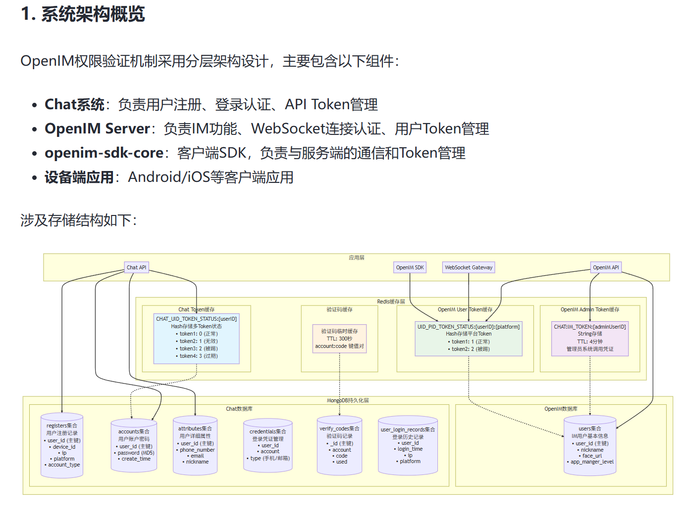

# 02 双 Token 认证机制与接入流程

## 原文主题

对应掘金文章《OpenIM 源码深度解析系列（二）：双 Token 认证机制与接入流程》：https://juejin.cn/post/7516100315853766706

本文在“双 Token”基础上补充完整工程里的第三类 Token：OpenIM Admin Token。

## 本文目标

讲清楚 Chat Token、OpenIM Admin Token、OpenIM User Token 的生成、使用、Redis 存储、WebSocket 鉴权和踢端失效。

## 架构图

这张图的核心含义是：Chat 侧和 OpenIM 侧各有自己的 Token 缓存和持久化数据。Chat Token 用于 Chat API；OpenIM User Token 用于 SDK/WebSocket；OpenIM Admin Token 用于服务端调用 OpenIM 管理接口。

## 核心结论

- Chat Token 不能用于 WebSocket 建连。
- OpenIM User Token 绑定 userID + platformID，是 SDK 接入 IM 的凭证。
- OpenIM Admin Token 是服务端权限，不应下发给普通客户端。
- 踢端必须同时处理连接关闭和 Token 状态失效。

## 源码入口

| 类型 | 路径 |
| --- | --- |
| Chat 登录注册 API | `chat/internal/api/chat/chat.go` |
| Chat 登录注册 RPC | `chat/internal/rpc/chat/login.go` |
| Chat Token | `chat/internal/rpc/admin/token.go`、`chat/pkg/common/db/cache/token.go` |
| Chat 调 OpenIM | `chat/pkg/common/imapi/caller.go` |
| OpenIM Auth RPC | `open-im-server/internal/rpc/auth/auth.go` |
| OpenIM Token 存储 | `open-im-server/pkg/common/storage/controller/auth.go`、`cache/cachekey/token.go`、`cache/redis/token.go` |
| WebSocket 鉴权 | `open-im-server/internal/msggateway/ws_server.go`、`context.go` |

## 详细源码解析

注册和登录先进入 `chat/internal/api/chat/chat.go`。真正逻辑在 `chat/internal/rpc/chat/login.go`。登录成功后，Chat 侧通过 `Admin.CreateToken` 生成 Chat Token；如果需要 IM 接入，则通过 `chat/pkg/common/imapi/caller.go` 获取 OpenIM Admin Token，再调用 OpenIM 获取用户 Token。

OpenIM Admin/User Token 的签发在 `open-im-server/internal/rpc/auth/auth.go`：`GetAdminToken` 使用 AdminPlatformID，`GetUserToken` 使用请求中的 platformID。底层 `open-im-server/pkg/common/storage/controller/auth.go` 的 `CreateToken` 会生成 token，并通过 Redis 记录状态。

WebSocket 建连时，`msggateway/context.go` 解析 token、sendID、platformID、operationID、sdkType。`ws_server.go` 的 `validate` 调 Auth RPC `ParseToken`，并由 `validateRespWithRequest` 校验 token 中的 userID/platformID 是否与请求一致。

## 数据结构与存储

- Chat Token Redis key：`CHAT_UID_TOKEN_STATUS:{userID}`，见 `chat/pkg/common/db/cache/token.go`。
- OpenIM User Token Redis key：`UID_PID_TOKEN_STATUS:{userID}:{platformName}`，见 `open-im-server/pkg/common/storage/cache/cachekey/token.go`。
- Chat Mongo collections：`account`/`accounts`、`attribute`/`attributes`、`credential`/`credentials`、`verify_code`/`verify_codes`、`register`/`registers`、`user_login_record`。
- OpenIM Mongo collections：`users` 等 IM 用户数据。

## 设计取舍

分 Token 的好处是领域边界清晰：Chat 可以替换登录方式，OpenIM 只关心 IM 用户接入。缺点是链路更长，排障时要定位是 Chat 登录失败、Admin Token 获取失败、User Token 获取失败，还是 WebSocket 鉴权失败。

## 面试讲法

> OpenIM 不是一个 Token 走到底。Chat Token 是产品层登录态，OpenIM Admin Token 是服务端调用 OpenIM API 的权限，OpenIM User Token 是 SDK 连接 WebSocket 的凭证。登录流程是 Chat 先完成业务账号校验，再拿 Admin Token 向 OpenIM 换用户 Token，客户端 SDK 用 User Token 建连。

## 面试官追问

| 问题 | 考察点 | 回答思路 | 源码依据 | 容易说错的点 |
| --- | --- | --- | --- | --- |
| Chat Token 能连 WebSocket 吗？ | Token 边界 | 不能，gateway 解析的是 OpenIM User Token | `msggateway/ws_server.go` | 两类 token 混用 |
| Admin Token 给谁用？ | 权限边界 | Chat 服务端/管理端，不给普通客户端 | `imapi/caller.go` | 下发给 App |
| platformID 有什么用？ | 多端 | 绑定设备平台，支持多端策略 | `UID_PID_TOKEN_STATUS` | 只按 userID 管 token |
| 踢端怎么做？ | 连接+状态 | 关闭旧连接并置旧 token 失效 | `KickUserConn`、`KickTokens` | 只断连接 |
| Token 存 Redis 为什么？ | 状态化 token | 便于失效、踢端、过期状态查询 | `cache/redis/token.go` | 只说 JWT 无状态 |

## 和本地项目的关系

本地源码中 Chat 和 OpenIM Server 都完整存在，可以直接跟踪从 `chat Login` 到 `OpenIM GetUserToken` 再到 `msggateway ParseToken` 的链路。

## 小结

Token 机制的面试重点不是“怎么生成 JWT”，而是领域边界、Redis 状态、平台维度和 WebSocket 鉴权。
